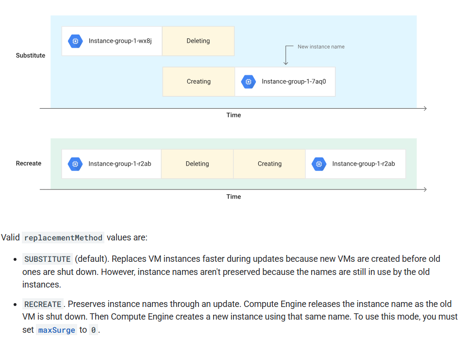

# GCE,Google Compute Engine

## GCE特點
### 支援Load balancing,auto scaling
### 可連接網路及儲存空間
### vm種類
* General Purpose (E2, N2, N2D, N1) : Best price-performance ratio
Web and application servers, Small-medium databases, Dev environments
* Memory Optimized (M2, M1): Ultra high memory workloads
Large in-memory databases and In-memory analytics
* Compute Optimized (C2): Compute intensive workloads
Gaming applications

## Image簡介
>可使用公開image或客製化image

## IP設定
* 外部ip(Internet addressable)
* 內部ip(internal to a corporate network)
* 靜態ip(static ip,ip不會因為vm開關而異動)
* 不能有兩個相同的外部ip，但兩個不同的公司網路可以有相同的內部ip(https://g.co/gemini/share/edfcfc9f349c)
* 所有的vm至少要分配一組內部ip
* 當vm停止時外部ip也會消失
* 如果想要確保不論vm的狀態如何都不會使ip受影響，可以手動設定靜態ip(https://g.co/gemini/share/2e2fbe6df112)
* 同一組靜態ip可以在同專案底下的vm間切換
* 不論是否使用靜態ip，一旦開啟後就會收費

## 建立vm http server
### 設定啟動腳本(startup script)
* 機器開機後開始自動執行所有要安裝的Application與設定
* 撰寫好執行命令儲存到config中(https://g.co/gemini/share/541940952ff4)

### instance template
* 進階的腳本，連硬體配置都可以在腳本中指定(https://g.co/gemini/share/c00fc7318e54)
* 用來創建相似的vm實例及管理instance group
* 如果要調整須直接修改template

### 減少啟動vm的時間
* 如果先啟動image os然後再在安裝軟體會花費額外時間
* 建議先安裝好軟體後打包image os，好處是  
   1. 各專案間可分享
   2. 可以指定硬體配置
   3. 特定客製化的版本image以求符合公司需求

### Sustained use discounts(續用折扣，用越多折越多)
* automatic discount: 使用一段時間後會針對每一分鐘有額外折扣(20%~50%)
* gke和gce都可以有折扣
* 某些型號的vm沒有折扣(E2/A2)
* APP engine flexible和dataflow建立的vm不符合折扣標準

### Committed use discounts(承諾使用折扣，簽約方式買斷)
* 如字面所示

### Preemptible VM(搶佔式vm，80%折扣)
* 很在意價格且大多為不重要不緊急的運算需求，可以開Preemptible VM
* 開機一次最多只能用24小時，時間到再還給Google，需要就再開新的。但如果突然其他用戶需要開正式機器，它就會回收給你的機器
* NO SLA and CANNOT be migrated to regular VMs

### Spot VMs(60%~91%折扣，每月價格浮動)
* 同搶佔式vm，但沒有最高24小時的限制
* 不見得可以隨時使用

### 收費
* gce按秒收費
* vm stop狀態不收費，但儲存空間會收費
* 建議開收費警示

### Live Migration(即時遷移)
* 在不重新啟動虛擬機器的情況下，將您運作中的虛擬主機遷移至同區其他主機(軟硬體故障或升級)
* 有掛local ssd才可以啟用
* gpu和搶佔式vm不支援
* 相同區域的vm instance才可以即時遷移

### Availability Policy(訂定使用規則)
* 定期基礎設施維護期間應該執行什麼動作(On host maintenance)？  
    * Migrate（預設選項）：將VM Instance遷移到其他硬體
    * 終止：對VM instance執行關閉
* 自動重新啟動:如果VM Instance因非人為因素而停機，則重新啟動VM instance。通常的原因是GCP底層的維護事件、非計劃性的硬體故障等。

### 自訂義vm
* 當預設型號沒有符合需求時可自行選配
* 記憶體(gb)和vcpu(core)分開計價

### gpu vm
* 注意安裝的gpu library是否正確(cuda)
* gpu的On host maintenance只能選擇Terminate VM instance
* 建議設定 Automatic restart - on

### 注意事項
* vm和專案互相關聯
* 運行中的vm無法更改型號，stop vm可以調整vgpu,ram
* vm可以被各種attribute filter(Name, Zone, Machine Type, Internal/External IP, Network, Labels etc)
* 善用labels管理環境、團隊單位的vm

### 常見使用情境

