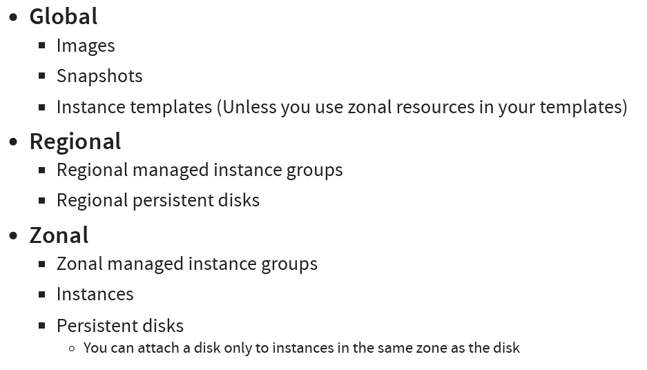

# Storage
## 介紹
### Storage Types


#### 區塊儲存 (Block Storage)


* 基本概念
資料分割： 區塊儲存將資料分割成固定大小的區塊，每個區塊都是獨立的，可以儲存在不同的位置。
原始儲存： 區塊儲存提供的是原始儲存，不包含檔案系統等metadata。
高效能： 由於資料分散儲存，讀寫速度非常快，延遲低，適合需要高速隨機存取的應用程式。

* 優點
高效能： 讀寫速度快，延遲低，適合需要高速隨機存取的應用程式，如資料庫、虛擬機器等。
彈性： 可以根據需求靈活調整儲存容量，擴展性強。
可靠性： 資料分散儲存，即使部分硬體故障，資料仍然可以存取。

* 缺點
成本較高： 相對檔案儲存，區塊儲存的成本較高。
管理複雜： 需要專業的知識和工具進行管理。
不適合小檔案： 不適合儲存大量小檔案，效率較低

#### block storage 補充
1. 通常來說一個block storage可以連接到一個virtual server(也可以同時連接多個block storage到一個virtual server)

#### 檔案儲存 (File Storage)


* 基本概念
階層式結構： 檔案儲存以檔案為單位，檔案組成目錄，目錄再組成檔案系統，形成樹狀的階層式結構。
metadata： 檔案儲存包含檔案名稱、大小、建立時間等metadata。
易於使用： 使用者可以像操作本地檔案一樣，輕鬆管理和存取檔案。

* 優點
易於使用： 使用者可以通過熟悉的檔案總管或命令行工具，輕鬆管理和存取檔案。
成本較低： 相對區塊儲存，檔案儲存的成本較低。
適合小檔案： 適合儲存大量小檔案，如文件、圖片等。

* 缺點
效能較低： 讀寫速度相對區塊儲存較慢，延遲較高。
擴展性有限： 擴展性相對區塊儲存較差。
可靠性較低： 單點故障風險較高。

* 適用情境
檔案伺服器： 共享檔案，如辦公文件、多媒體檔案等。
內容管理系統： 儲存網站內容，如文章、圖片等。
備份與歸檔： 儲存備份資料、歸檔資料等。

#### file storage 補充
1. 檔案在多個virtual server間分享

#### 其他補充
1. DAS (Direct-Attached Storage) - 直接附加儲存
DAS 是一種最傳統的儲存方式，儲存裝置（例如硬碟或固態硬碟）直接連接到伺服器主機。這種連接通常是透過內部匯流排（例如SATA、SAS、NVMe）或外部介面（例如USB、Thunderbolt）。在DAS架構中，儲存資源是專屬於連接的伺服器，不能直接被其他伺服器或客戶端共享

2. NAS (Network-Attached Storage) - 網路附加儲存
NAS 是一種專門的檔案伺服器，它透過網路（通常是以太網路）連接到網路環境中。NAS 設備本身包含了作業系統、檔案系統和儲存硬碟，它提供檔案層級的資料共享服務。網路中的使用者或伺服器可以透過標準的網路協定（例如CIFS/SMB、NFS、AFP）來存取NAS上的檔案。

3. SAN (Storage Area Network) - 儲存區域網路
SAN 是一種專門用於儲存的、高速的、獨立的網路。SAN 使用光纖通道（Fibre Channel）或 iSCSI 等協定，將多個伺服器連接到一個共享的儲存池。SAN 提供區塊層級的資料存取，伺服器將 SAN 儲存視為本地硬碟一樣進行操作。SAN 的主要目標是提供高性能、高可用性、高擴展性的儲存解決方案，通常應用於企業級的關鍵業務環境。


### GCP - Block Storage
* Block Storage:
1. Google Compute Engine Persistent Disk (永久磁碟)
> Persistent Disk (PD) 是 GCP 最基礎和常用的區塊儲存服務，==專為 Google Compute Engine 虛擬機器 (VM) 設計==。PD 提供可靠、高效能的區塊儲存，並==與 VM 實例生命週期分離==，即使 VM 停止或刪除，PD 上的資料仍然保留

* 主要特色：
多種磁碟類型:
1. 標準永久磁碟 (pd-standard): 經濟實惠，適用於不常存取的資料或開發/測試環境。基於標準硬碟 (HDD)。
2. 平衡永久磁碟 (pd-balanced): 性價比高，適用於大多數通用工作負載。基於固態硬碟 (SSD)。
3. SSD 永久磁碟 (效能型永久磁碟) (pd-ssd): 高效能，適用於延遲敏感型應用程式和高 IOPS 工作負載，如資料庫。基於 SSD。
4. 極致永久磁碟 (pd-extreme-ssd): 最高效能，提供可調的 IOPS 和吞吐量，適用於最嚴苛的工作負載，如大型資料庫和高效能運算。基於 SSD。

* 適用場景
1. VM 啟動磁碟： 作為 Compute Engine VM 的作業系統啟動磁碟。
2. 資料庫儲存： 儲存關聯式資料庫 (如 MySQL, PostgreSQL, SQL Server) 和 NoSQL 資料庫 (如 MongoDB, Cassandra) 的資料和日誌。
3. 企業應用程式： 支援各種企業應用程式，如 ERP, CRM, SCM 等。
4. 開發和測試環境： 經濟實惠的標準和平衡永久磁碟非常適合開發和測試環境。

#### Persistent Disks (PD)
* Network block storage attached to your VM instance
* Increase size when you need it (For higher performance, resize or add more PDs)
* Zonal PDs replicated in single zone. Regional PDs replicated in 2 zones in same Region
*  Regional PDs are 2X the cost of Zonal PDs


#### Persistent Disks - Snapshots
> Persistent Disk 快照是 Google Cloud Platform (GCP) 提供的一項重要資料保護功能，它允許您在特定時間點建立 Persistent Disk 的完整且一致的副本
> 簡單來說，Persistent Disk 快照就像是為您的 Persistent Disk 拍攝的「照片」。這個照片記錄了在拍攝快照那一刻，磁碟上的所有資料狀態。您可以將快照理解為：
> * 時間點副本： 快照捕捉的是特定時間點的磁碟資料，就像您按下相機快門那一瞬間的影像。
> * 增量式備份： GCP 快照是增量式的，這表示第一次快照是完整副本，後續的快照只會儲存自上次快照以來 發生變更的區塊。這大幅節省了儲存空間和快照建立時間。
> * 獨立於來源磁碟： 快照一旦建立，就與來源 Persistent Disk 脫鉤。即使您刪除原始磁碟，快照仍然存在，確保資料安全。

1. 資料備份與還原 (Data Backup and Recovery):
* 定期備份： 您可以設定定期快照排程，例如每天、每週或每月，自動備份您的 Persistent Disk。
* 快速還原： 當資料遺失、損壞或需要回復到先前的狀態時，您可以從快照快速還原整個 Persistent Disk，或建立一個新的 Persistent Disk。
* 多個還原點： 您可以保留多個時間點的快照，提供更彈性的還原選項，例如還原到前一天、前一週或更早的狀態。

2. 災難復原 (Disaster Recovery):
* 異地備份： 快照可以儲存在與 Persistent Disk 不同的區域，甚至不同的 Google Cloud Storage 位置，提供異地備份能力，以應對區域性故障或災難。
* 快速恢復服務： 在發生災難時，您可以利用異地快照在另一個區域快速重建 Persistent Disk 和相關的虛擬機器 (VM)，縮短服務中斷時間。

3. 測試與開發 (Testing and Development):
* 建立測試環境： 您可以從生產環境的 Persistent Disk 快照快速建立一個獨立的測試或開發環境，用於測試新功能、修復錯誤或進行效能測試，而不會影響生產系統。
* 版本控制與回溯： 在進行重大變更或實驗性操作之前，先建立快照，如果出現問題，可以快速回溯到快照時的狀態。

@ Snapshots 補充
**Keep similar data together on a Persistent Disk**
避免太頻繁的使用Snapshots(頻率>1小時)
避免再應用程式使用高峰期進行snapshots(即便磁碟空間足夠仍會影響效能)
花費時間: 從snapshots建立disk < 從image建立disk
如果要重複性的從snapshot建立disk，建議使用 Create an image from snapshot and use the image to create disks

#### Machine Images (機器映像檔)
> GCP Machine Images 是一種 Compute Engine 資源，它讓您可以擷取虛擬機器 (VM) 執行個體的所有組態資訊，包括開機磁碟、資料磁碟，以及執行個體的屬性設定。您可以將 Machine Images 視為一種更全面、更完整的 VM 範本，它不僅包含磁碟的內容，還記錄了 VM 執行個體的硬體和軟體設定。
> 簡單來說，Machine Image就像是您 VM 的完整快照，可以讓您快速、一致地複製出新的 VM 執行個體或建立執行個體範本。

 


#### Local SSDs
* 資料只有在Instance執行時存在(Ephemeral storage)
* 資料自動加密
* 和VM生命週期綁定
* Local SSDs 只支援特定型號的機器
* Supports SCSI and NVMe interfaces
* NVMe-enabled and multi-queue SCSI images for best performance
* **Very Fast I/O (~ 10-100X compared to PDs)**
* 不可以同時連接多個VM Instance


2. Google Cloud Hyperdisk (超磁碟)
> Hyperdisk 是 GCP 新一代的高效能區塊儲存服務，旨在滿足最嚴苛的工作負載需求。Hyperdisk 提供前所未有的效能和彈性，並簡化了儲存管理

* 主要特性：
三種 Hyperdisk 類型：
1. Hyperdisk Extreme (超高效能超磁碟) (hyperdisk-extreme): 為效能而生，提供極高的 IOPS 和吞吐量，適用於對延遲極度敏感的應用程式，如 SAP HANA、Oracle 資料庫等。可以精細調整 IOPS 和吞吐量。
2. Hyperdisk Balanced (平衡型超磁碟) (hyperdisk-balanced): 提供卓越的性價比，效能顯著優於平衡永久磁碟，適用於各種企業級應用程式和中等規模的資料庫。
3. Hyperdisk Throughput (吞吐量型超磁碟) (hyperdisk-throughput): 針對吞吐量優化，適用於大型循序讀寫工作負載，如資料倉儲、日誌處理、分析等。

#### 常見命令
```{.line-numbers}
# gcloud compute disks list/create/delete/resize/snapshot

# create
gcloud compute disks create my-disk-1 --zone=us-east1-a
--size=SIZE (1GB or 2TB)
--type=TYPE (default - pd-standard) (gcloud compute disk-types list)
--image --image-family --source-disk --source-snapshot(What should be on the disk?)
--image --image-family --source-disk --source-snapshot(How should data on disk be encrypted?)

# resize(Only increasing disk size is supported)
gcloud compute disks resize example-disk-1 --size=6TB

# snapshot
gcloud compute disks snapshot test --zone=us-central1-a --snapshotnames=snapshot-test
```

```{.line-numbers}
# gcloud compute images create my-image 
From a Disk 
--source-disk=my-disk --source-disk-zone=us-east1-a 

From a Snapshot 
--source-snapshot=source-snapshot 

From another image 
--source-image=source-image --source-image-project=source-image-project 

From latest non deprecated image from a family 
--source-image-family=source-image-family --source-imageproject=source-image-project
```

```{.line-numbers}
# 將 Google Compute Engine (GCE) 中的 映像檔 (image) 標示為 已停用 (DEPRECATED)
gcloud compute images deprecate IMAGE --state=DEPRECATED

# Exports virtual disk images
gcloud compute images export --image=my-image --destination-uri=gs://my-bucket/my-image.vmdk --export-format=vmdk --project=my-project

gcloud compute images delete my-image1 my-image2 
gcloud compute images list format="value(NAME)"
```

```{.line-numbers}
# BETA 測試
# Create Machine Image
gcloud beta compute machine-images create MACHINE_IMAGE_NAME --source-instance SOURCE_INSTANCE_NAME

# Create an Instance from the Machine Image
gcloud beta compute instances create VM_NAME --zone ZONE --source-machine-image SOURCE_MACHINE_IMAGE_NAME
```
#### 常見場景


### GCP - Cloud Filestore(File Storage)
>  Cloud Filestore 是一個全託管的網路附加儲存 (NAS) 服務，提供高效能、可擴展、企業級的檔案儲存解決方案。它支援標準的 NFSv3 和 NFSv4.1 協定，可以輕鬆地與 Compute Engine VM、Google Kubernetes Engine (GKE) 叢集和其他 GCP 服務整合


1. Cloud Filestore
* 全託管 NAS： GCP 完全管理 Filestore 基礎架構，使用者無需管理硬體、軟體或進行維護。
* NFS 協定支援： 支援 NFSv3 和 NFSv4.1 協定，與 Linux 和 Windows 工作負載相容。
* 多種服務級別： 提供兩種服務級別：
    * 基本型 (Basic Tier)： 經濟實惠，適用於一般檔案共享和開發測試環境。
    * 企業型 (Enterprise Tier)： 高效能、高可用性，適用於企業級應用程式和生產環境，提供區域多重可用區選項。
* 快照： 支援建立檔案系統快照，用於資料備份和還原。
* 加密： 資料預設加密，支援 CMEK。
* IP 位址存取控制： 透過 IP 位址範圍控制對 Filestore 實例的存取。
* 擴展性： 可以根據需求擴展容量和效能。

* 適用場景：
    * 網站內容管理系統 (CMS)： 儲存網站內容、媒體檔案、圖片等。
    * 企業檔案共享： 作為部門或團隊之間的文件共享平台。
    * 開發和測試環境： 提供共享的開發和測試環境。
    * 媒體和娛樂： 影片編輯、後期製作、數位資產管理等。
    * GKE 持續性儲存： 為 GKE 叢集中的容器應用程式提供持久性儲存。

#### 常見場景


### 整理 Global, Regional and Zonal Resources


