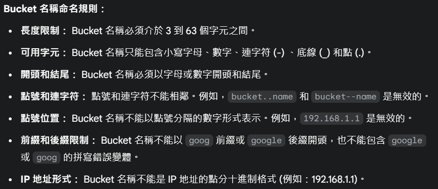
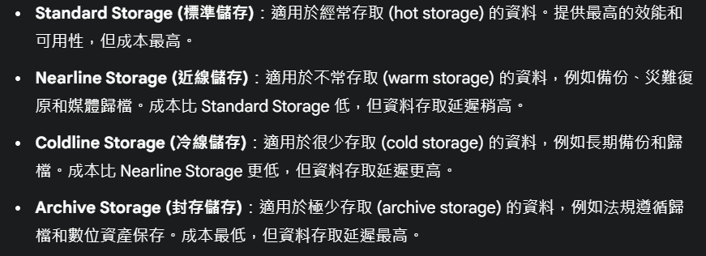
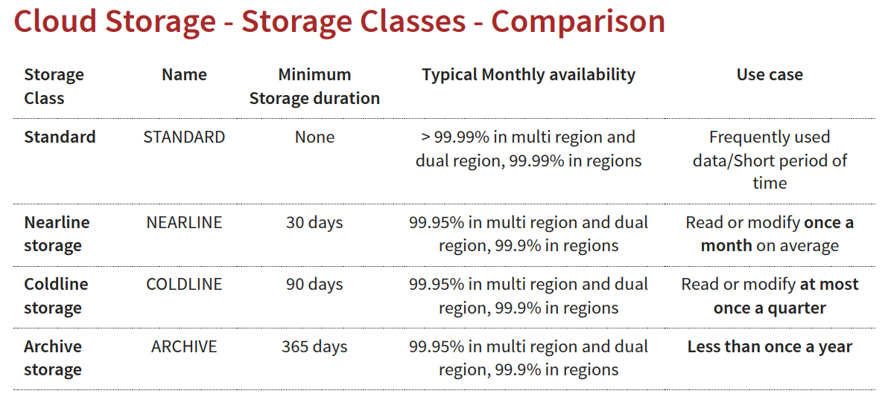
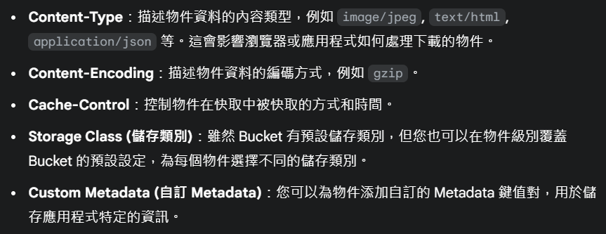
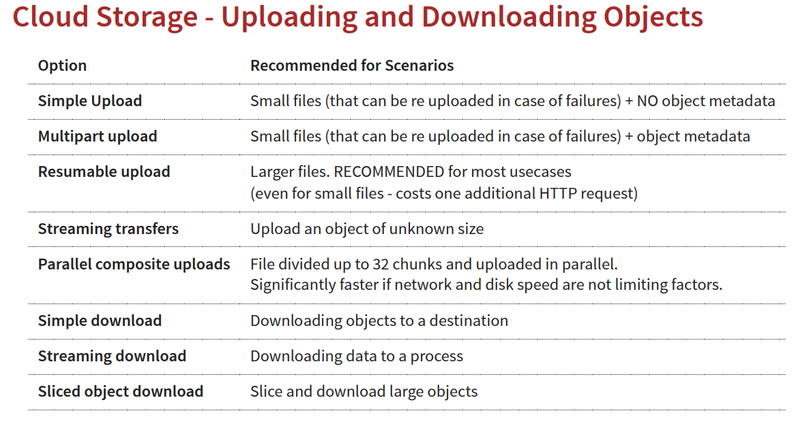
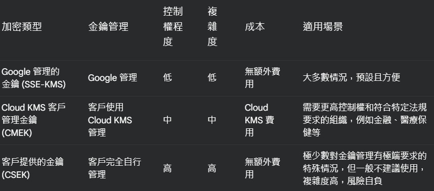
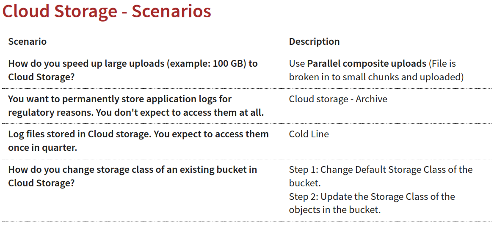

# Object Storage - Cloud Storage
## 介紹
### Google Cloud Storage (GCS)
> Google Cloud Storage (GCS) 是 Google Cloud Platform (GCP) 提供的物件儲存服務
> GCS 與傳統的檔案儲存系統不同，它以 物件 (Object) 的形式儲存資料，而不是以檔案和目錄的形式。每個物件都儲存在一個 儲存空間 (Bucket) 中，並且具有唯一的名稱。

* 主要特性
    1. 物件儲存 (Object Storage)：GCS 是一個==物件儲存服務==，這意味著資料被儲存為物件，而不是檔案。==物件儲存更適合儲存大量非結構化資料==，並且更容易擴展和管理。

    2. 可擴展性 (Scalability)：GCS 能夠自動擴展以應對不斷增長的資料儲存需求。您無需擔心儲存容量的限制，可以根據需要儲存任意大小的資料。

    3. 耐用性和可用性 (Durability & Availability)：GCS 設計為高度耐用和可用。 Google 保證 GCS 儲存類別的耐用性至少為 99.999999999% (11 個 9)，這意味著資料遺失的機率極低。同時，GCS 也提供高可用性，確保您能夠隨時存取您的資料。

    4. 安全性 (Security)：GCS 提供多層安全機制來保護您的資料，包括：
        * 資料加密：資料在傳輸和儲存時都會被加密。您可以選擇使用 Google 管理的金鑰或您自己管理的金鑰進行加密。
        * 存取控制：您可以透過 Identity and Access Management (IAM) 精細地控制誰可以存取您的儲存空間和物件。
        * 版本控制：您可以啟用版本控制來保留物件的歷史版本，防止意外刪除或覆蓋。
        稽核日誌：GCS 會記錄所有儲存空間和物件的操作，方便您進行安全稽核和監控

#### 補充說明
* 使用key-value儲存大型檔案(任何檔案型別都可以儲存)，無法更新檔案部分內容，建議操作整個物件
* 提供多種方式操作:
    1. gsutil 命令行工具 (gsutil command-line tool)：透過命令行介面管理 GCS，適用於自動化腳本和批次處理
    2. Cloud Storage API (雲端儲存 API)：使用程式碼透過 API 介面與 GCS 互動，適用於應用程式開發
    3. Cloud Storage Client Libraries (雲端儲存用戶端程式庫)：Google 提供多種程式語言的用戶端程式庫 (例如 Python, Java, Go, Node.js 等)

### Cloud Storage - Objects and Buckets
#### Buckets(儲存空間)
> Bucket (儲存空間) 是用於存放您資料物件的容器。

* 重要特性
    1. 全球唯一名稱 (Globally Unique Name)：如前所述，==Bucket 名稱必須是全球唯一的==。選擇 Bucket 名稱時需要遵循一定的命名規則 。
    

    2. 地理位置 (Location)：當您創建 Bucket 時，需要選擇其地理位置。位置決定了您的資料實際儲存在 Google 基礎架構的哪個地理區域或多個區域。GCS 提供不同的位置類型，例如：

        * 區域 (Region)：資料儲存在特定地理區域內的單個資料中心。例如：us-central1 (愛荷華州)。區域級別提供較低的延遲和較高的效能，但容錯能力較低。

        * 雙區域 (Dual-region)：資料同步儲存在同一地理區域內的兩個不同區域。例如：us-east1 & us-east2。雙區域提供更高的可用性和資料持久性，能夠承受單一區域故障，但成本會略高。

        * 多區域 (Multi-region)：資料分散儲存在大型地理區域 (例如：美國、歐洲、亞洲) 內的多個區域。例如：us (美國)。多區域提供最高的可用性和資料持久性，能夠承受整個區域的故障，並且可以根據使用者位置提供較低的延遲，但成本最高。

        * Cloud Storage 區域 (Region Types)：您可以更精細地選擇區域類型，例如 regional, dual-regional, multi-regional 和 nearline/coldline/archive regional 等，以更符合您的效能、可用性和成本需求。
    
    3. 預設儲存類別 (Default Storage Class)：在 Bucket 級別，您可以設定一個預設的儲存類別。當您上傳物件到這個 Bucket 時，如果沒有特別指定，物件將會繼承這個預設的儲存類別。
        * 服務水準協議 (SLA)
        Committed SLA is 99.95% for multi region and 99.9% for
        single region for Standard, Nearline and Coldline storage
        classes

        
        

    4. 存取控制 (Access Control)：Bucket 是存取控制的主要單位。您可以使用 Identity and Access Management (IAM) 來設定 Bucket 的權限，控制哪些使用者或服務帳戶可以對 Bucket 以及 Bucket 內的物件進行操作 (例如：讀取、寫入、刪除)。

    5. 版本控制 (Versioning)：您可以在 Bucket 上啟用版本控制功能。啟用後，每次物件被覆蓋或刪除時，GCS 會保留舊版本的物件，以防止資料意外遺失(誤刪)，並允許您恢復到之前的版本。
    Older versions are uniquely identified by (object key + a generation
    number)

    6. 生命週期管理 (Lifecycle Management)：Bucket 可以設定生命週期管理規則，==自動執行物件的儲存類別轉換(SetStorageClass)、物件刪除==等操作。例如，您可以設定規則將超過 30 天未存取的物件自動轉換為 Coldline Storage 以節省成本，或者將 5 年前的日誌檔案自動刪除。

    7. 請求者付費 (Requester Pays)：Bucket 可以設定為請求者付費模式。在這種模式下，下載 Bucket 中物件的請求者 (而不是 Bucket 的擁有者) 需要支付資料下載和操作費用。這通常用於公開資料集，讓資料提供者無需承擔大量下載流量費用。

    #### Object (物件)
    > 在 Google Cloud Storage 中，Object (物件) 是您實際儲存的資料本身

    * 重要特性
        1. 物件金鑰 (Object Key)：在每個 Bucket 內，Object Key (物件金鑰) 是物件的唯一名稱  
            * Bucket 內的唯一性： 在同一個 Bucket 內，Object Key 必須是唯一的

            * 層級結構的模擬 (Simulated Hierarchy)：雖然 GCS 是一個扁平的物件儲存系統，並不是傳統的檔案系統，但您可以透過在 Object Key 中使用斜線 / 來模擬層級目錄結構。例如，您可以將 Object Key 命名為 images/vacation/beach.jpg，雖然 GCS 內部沒有實際的目錄結構，但 Google Cloud Console 和工具會將使用斜線分隔的 Object Key 呈現 為目錄結構，方便管理物件。

        2. 資料 (Data)：Object 儲存的是實際的二進制資料內容

        3. Metadata：每個 Object 都關聯一組 Metadata，用於描述物件的屬性
            

        4. 物件上傳與下載
        

> **@補充**
> bucket中可以儲存任意數目的物件(單一個物件最大的限制為5TB)
> 每一個bucket都和project相關聯
> 完整的物件路徑可以被認為是 gs://<bucket-name>/<object-key>

#### Cloud Storage - Encryption


#### 常見場景


#### 常見指令
**gsutil is the CLI for Cloud Storage (NOT gcloud)**
```{.line-numbers}
# Create Cloud Storage bucket
gsutil mb gs://BKT_NAME

# List current and non-current object versions
gsutil ls -a gs://BKT_NAME 

# Copy objects
gsutil cp gs://SRC_BKT/SRC_OBJ gs://DESTN_BKT/NAME_COPY
-o 'GSUtil:encryption_key=ENCRYPTION_KEY' - Encrypt Object

# Rename objects
gsutil mv gs://BKT_NAME/OLD_OBJ_NAME gs://BKT_NAME/NEW_OBJ_NAME

# Move objects
gsutil mv gs://OLD_BUCKET_NAME/OLD_OBJECT_NAME gs://NEW_BKT_NAME/NEW_OBJ_NAME

# Change StorageClass for objects
gsutil rewrite -s STORAGE_CLASS gs://BKT_NAME/OBJ_PATH

# Upload Objects
gsutil cp LOCAL_LOCATION gs://DESTINATION_BKT_NAME/

# Download Objects
gsutil cp gs://BKT_NAME/OBJ_PATH LOCAL_LOCATION

# Enable Versioning
gsutil versioning set on gs://BKT_NAME

# Disable Versioning
gsutil versioning set off gs://BKT_NAME
```

> 統一儲存桶層級存取 (Uniform Bucket-Level Access) 
> 啟用統一儲存桶層級存取後，gsutil acl ch 指令對於物件的 ACLs 設定將會變得無效 (或效果非常有限)。 因為系統會強制執行 IAM 政策作為唯一的存取控制機制
> gsutil acl ch 則應被視為過時或僅在特定極端情況下使用的工具，例如:需要與舊系統或工作流程保持 ACL 相容性時。 (例如，某些舊應用程式可能仍然依賴 ACLs)

```{.line-numbers}
# 設定bucket的統一儲存桶層級存取
gsutil uniformbucketlevelaccess set on/off gs://BKT_NAME
- on (只能透過設定 IAM 政策來控制對 gs://my-example-bucket 的存取)
- off (預設的存取控制模式，您可以使用 ACLs 和 IAM 政策來管理存取權限)
```

> 存取控制清單 (ACLs) 是 GCS 中一種較舊的存取控制機制 (相對於較新的 IAM - Identity and Access Management)。
> 每個 GCS 儲存桶和物件都關聯著一個 ACL，這個 ACL 是一個 權限清單，列出了誰被允許做什麼。
> **ACLs 像是針對每個儲存桶和物件的個別「門鎖」，您需要針對每個門鎖設定權限。**

ACLs 由一系列的 項目 (entries) 組成，每個項目指定：

* 授權對象 (Grantee): 可以是個別使用者、群組或特殊群體 (例如所有使用者、所有已驗證的使用者)。
* 權限 (Permission): 定義了授權對象被允許執行的操作 (例如 READ, WRITE, OWNER)。

1. 授權對象 (Grantee) 的類型：
    * 使用者 (User): 透過其 Google 帳戶的電子郵件地址識別。
    * 群組 (Group): 透過其 Google 群組的電子郵件地址識別。
    * 網域 (Domain): 屬於特定網域的所有使用者。
    * 所有使用者 (All Users): 網際網路上任何人，即使沒有 Google 帳戶。 (代碼: AllUsers)
    * 所有已驗證的使用者 (All Authenticated Users): 任何持有 Google 帳戶並已登入的使用者。 (代碼: AllAuthenticatedUsers)
    * 專案團隊成員 (Project Team): 指 Google Cloud 專案的成員，包括編輯者、擁有者和檢視者。 (代碼: project-editors, project-owners, project-viewers)
    權限 (Permission) 的類型：

2. 儲存桶權限:
    * READ: 允許列出儲存桶中的物件。
    * WRITE: 允許在儲存桶中建立、覆寫和刪除物件。
    * OWNER: 擁有儲存桶的完全控制權，包括管理權限和刪除儲存桶。

3. 物件權限:
    * READ: 允許下載物件和讀取物件的 metadata。
    * WRITE: 允許覆寫和刪除物件。(注意: 一般來說，物件的寫入通常透過儲存桶的 WRITE 權限控制，物件 ACLs 的 WRITE 權限較少使用)
    * OWNER: 擁有物件的完全控制權，包括管理權限和更改物件 ACLs。

```{.line-numbers}
# Make specific object public
gsutil acl ch -u AllUsers:R gs://BKT_NAME/OBJ_PATH

# Set Access Permissions for Specific Objects
gsutil acl ch -u john.doe@example.com:WRITE gs://BKT_NAME/OBJ_PATH
Permissions - READ (R), WRITE (W), OWNER (O)
Scope - User, allAuthenticatedUsers, allUsers(-u), Group (-g), Project (-p) etc
```

> GCP 現代且推薦的存取控制系統 
> IAM 透過 政策 (Policies) 來管理權限。IAM 政策會綁定到 GCP 的資源階層 (組織、資料夾、專案、儲存桶)，並授予 角色 (Roles) 給 成員 (Members)
> IAM 像是更全面的「門禁系統」，您可以在建築物 (專案) 的入口設定規則 (政策)，然後將通行證 (角色) 發給不同身份的人員 (成員)

```{.line-numbers}
# 授予使用者對儲存桶的物件檢視者 (Object Viewer) 角色
gsutil iam ch add user:viewer@example.com roles/storage.objectViewer gs://my-bucket

# 移除使用者對儲存桶的物件檢視者角色
gsutil iam ch remove user:viewer@example.com roles/storage.objectViewer gs://my-bucket

# 查看 IAM 政策
gsutil iam getpolicy gs://my-bucket
```

#### CLI替代方案
* 建議切換至 gcloud storage 的命令列執行效率更快
* 如不切換可以安裝用於運行 gcloud storage 的 shim，可在 gsutil 中無痛將指令替換為gcloud storage指令，若不支援則仍會以 gsutil 指令執行(In boto configuration file, configure use_gcloud_storage=True)


