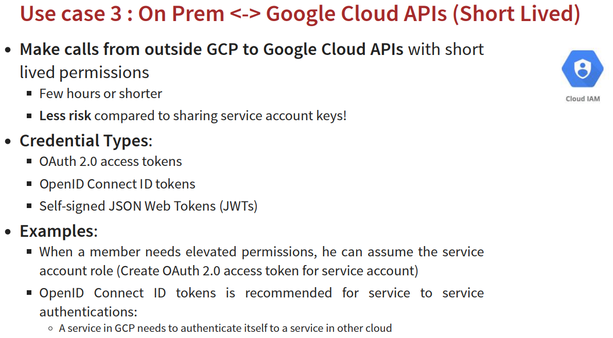

# IAM
## 介紹(可搭配 11.cloud storage 一同閱讀)
### GCP IAM：Google Cloud Platform 身分與存取管理
> GCP IAM 是 Google Cloud Platform (GCP) 的基礎服務，讓您可以精細地控制誰 (身分) 可以對您的 GCP 資源執行什麼操作 (存取權限)。  想像一下，您的 GCP 專案就像一間公司，而 IAM 就是公司的門禁和權限管理系統。它可以確保只有經過授權的人員才能進入公司 (存取資源) 並執行他們被允許的工作 (權限)。

#### 核心概念
1. 身分主體 (Principals)：誰可以存取您的 GCP 資源？

    * Google 帳戶 (使用者帳戶)： 
    代表個人使用者，例如您公司內的員工。
    * 服務帳戶 (Service Accounts)： 
    代表應用程式或虛擬機器 (VM) 執行個體等，用於自動化操作，例如應用程式存取 Cloud Storage 儲存資料。
    * Google 群組 (Google Groups)： 
    代表一群 Google 帳戶或服務帳戶，方便您一次性為多個成員授予權限。
    * 網域 (Domains)： 
    代表整個 Google Workspace 或 Cloud Identity 網域，您可以授予網域內的所有使用者權限 (較少使用，通常建議使用群組)。

2. 資源 (Resources)：什麼可以被存取？

    * 組織 (Organizations)： 
    代表您的整個公司或組織，是 GCP 資源階層的最頂層。
    * 資料夾 (Folders)： 
    用於在組織內組織和管理專案，方便管理不同部門或團隊的資源。
    * 專案 (Projects)： 
    是 GCP 資源階層的基本單位，您在專案中建立和使用各種 GCP 服務，例如 Compute Engine 執行個體、Cloud Storage 儲存空間、Cloud SQL 資料庫等。
    * 個別服務資源： 
    例如 Compute Engine 執行個體、Cloud Storage 儲存空間、Cloud SQL 資料庫、Pub/Sub 主題等，更細粒度的資源。

3. 角色 (Roles)： 可以執行什麼操作？

    * 預定義角色 (Predefined Roles)： 
    Google 提供的一系列預先定義的角色，涵蓋常見的存取權限需求。
        1. 基本角色 (Basic Roles)： 
        Owner、Editor、Viewer，適用於專案層級，非常廣泛的權限，不建議在生產環境中使用。
        2. 預定義角色 (Predefined Roles - 細粒度)： 
        針對特定 GCP 服務的細粒度角色，例如 roles/storage.objectViewer (Cloud Storage 物件檢視者)、roles/compute.instanceAdmin (Compute Engine 執行個體管理員)。 建議使用預定義角色來授予最小權限。
        3. 自訂角色 (Custom Roles)： 您可以根據自己的特定需求建立自訂角色，精確定義角色包含的權限。 適用於預定義角色無法滿足需求，需要更精細控制權限的場景。

4. 政策 (Policies)：如何授予權限？

    * IAM 政策 (IAM Policies)： 也稱為資源政策或存取控制清單 (ACLs)，直接附加到資源上，定義了誰對該資源具有哪些角色。 IAM 政策可以設定在組織、資料夾、專案和個別服務資源層級。
    * 組織政策 (Organization Policies)： 在組織層級設定，用於集中管理整個組織的 GCP 資源行為。 組織政策可以限制可以使用的 GCP 服務、資源的位置等。 與 IAM 政策不同，組織政策主要用於限制資源的使用方式，而不是授予存取權限。

#### GCP IAM 階層結構
GCP IAM 政策具有階層結構，權限會從上層向下層繼承，從高到低依次為:
組織層級 (Organization Level) => 資料夾層級 (Folder Level) => 專案層級 (Project Level) => 資源層級 (Resource Level)

#### 權限繼承和有效權限
* 繼承 (Inheritance)： 
下層資源會繼承上層資源的 IAM 政策

* 有效權限 (Effective Permissions)： 
使用者對資源的有效權限是所有適用於該資源及其上層資源的 IAM 政策的總和
(如果在某一層級授予了權限，但在另一層級拒絕了權限，則拒絕權限優先)
(如果在多個層級都授予了相同的角色，則最終的權限不會累加，仍然是該角色的權限)

#### 服務帳戶 (Service Accounts)
> 服務帳戶是一種特殊的 Google 帳戶，用於代表應用程式而非個人使用者
> * 應用程式身份驗證： 
> 讓應用程式能夠安全地存取 GCP 服務，而無需使用者直接參與驗證。 例如，一個在 Compute Engine 執行個體上運行的應用程式可以使用服務帳戶來存取 Cloud Storage 或 Cloud SQL。
> * 自動化任務： 
> 用於自動化執行 GCP 操作的腳本或工具，例如部署應用程式、備份資料等。

**不建議使用Default service account(自帶editor權限)**

1. Google 管理的服務帳戶 (Google-managed Service Accounts)
由 Google 自動建立和管理的。它們通常與特定的 GCP 服務相關聯，並被設計用於簡化某些常見的使用情境，使用者無法直接完全控制它們
Google 管理的服務代理的命名方式會根據不同的 GCP 服務而有所不同
ex. [PROJECT_NUMBER]-compute@developer.gserviceaccount.com

2. 使用者管理的服務帳戶 (User-managed Service Accounts)
由使用者自行建立和完全控制的。它們提供了最大的靈活性和控制權，是生產環境中推薦使用的服務帳戶類型
ex. my-user-managed-sa@my-project.iam.gserviceaccount.com

#### 常見指令
```{.line-numbers}
# Describe current project
gcloud compute project-info describe

# Access the Cloud Platform with Google user credentials
gcloud auth login

# Revoke access credentials for an account
gcloud auth revoke

# List active accounts
gcloud auth list
```

gcloud projects xxx
```{.line-numbers}
# Add IAM policy binding
gcloud projects add-iam-policy-binding

# Get IAM policy for a project
gcloud projects get-iam-policy

# Remove IAM policy binding
gcloud projects remove-iam-policy-binding

# Set the IAM policy
gcloud projects set-iam-policy

# Delete a project
gcloud projects delete -
```

gcloud projects xxx
```{.line-numbers}
# Describe an IAM role
gcloud iam roles describe

# create an iam role(--project, --permissions, --stage)
gcloud iam roles create

# Copy IAM Roles
gcloud iam roles copy
```

#### 使用案例





#### Cloud Storage - Signed URL
> 授權對 Cloud Storage 中私有物件進行臨時存取，而無需公開您的 Google Cloud 憑證或調整物件的 ACL (存取控制列表) 設定。 想像一下，您有一個私人的檔案櫃 (Cloud Storage Bucket)，裡面存放著重要的文件 (Objects)。 Signed URL 就像是一張限時通行證，您可以發給特定的人 (使用者或應用程式)，讓他們在指定的時間內可以打開檔案櫃 (Bucket) 並查看或修改裡面的特定文件 (Object)，但通行證過期後，他們就無法再存取了

* 常用場景
限時分享私有資料給外部使用者(Users do NOT need Google account)

* 建立步驟
1. Create a key (YOUR_KEY) for the Service Account/User with the desired permissions
2. Create Signed URL with the key
gsutil signurl -d 10m YOUR_KEY gs://BUCKET_NAME/OBJECT_PATH

#### Cloud Storage - Static website
> Google Cloud Storage (GCS) 提供了一個簡單、經濟高效且高度可擴展的方式來託管靜態網站。 您可以將 HTML、CSS、JavaScript、圖片等靜態內容直接上傳到 Cloud Storage Bucket，並將其配置為靜態網站，讓全球使用者可以透過網際網路存取您的網站

* 建立步驟
1. Create a bucket with the same name as website name (Name of bucket
should match DNS name of the website)
=> Verify that the domain is owned by you

2. Copy the files to the bucket (Add index and error html files for better user experience)

3. Add member allUsers and grant Storage Object Viewer option
=> Select Allow Public Access