# Database Fundamentals
## 資料庫觀念介紹(和之後的cloud sql, bigtable相關)
### 資料庫常見情景與名詞
#### 實際案例-1
> 我們有一個資料庫部署在倫敦，目前有兩個issue待解決:
> 1. Your database will go down if the data center crashes or the server storage fails
> 2. You will lose data if the database crashes

    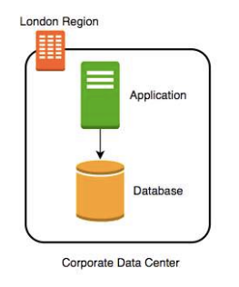

##### 解決步驟-1
> 建立每小時auto snapshot
> 1. Your database will go down if the data center crashes(未解決)
> 2. You will lose data if the database crashes(部份解決，但如果發生故障，仍然會丟失1小時的資料)
> 3. Database will be slow when you take snapshots(未解決，建立snapshot時會影響效能)

    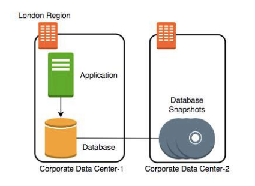

##### 解決步驟-2
> 建立transaction logs(資料庫系統中用於記錄所有變更的檔案，它可以確保資料庫的 ACID 特性，並在發生故障時恢復資料)，並每秒複製到第二個備援資料中心
> 1. Your database will go down if the data center crashes(未解決)
> 2. You will lose data if the database crashes(解決)
> 3. Database will be slow when you take snapshots(未解決，建立snapshot時會影響效能)

##### 解決步驟-3
> 建立standby database(主資料庫 (Primary Database) 的一個複本，主要用於提高資料庫系統的可用性和災難恢復能力。它通常與主資料庫保持同步，當主資料庫發生故障時，可以迅速切換到備用資料庫，確保系統的持續運行)
> 1. Your database will go down if the data center crashes(解決)
> 2. You will lose data if the database crashes(解決)
> 3. Database will be slow when you take snapshots(解決，改從standby database建立snapshot，確保main database效能不受影響)

    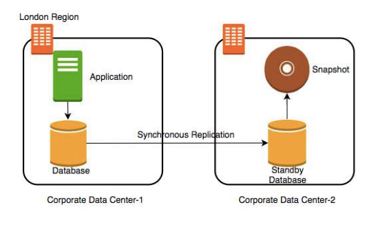

#### Availability and Durability
* 可用性 (Availability)
    > 指的是資料庫系統在需要時可以正常運作，提供服務的能力

    * 衡量指標
    通常用百分比表示，例如 99.99% 的可用性表示系統在一年中只有極少的時間無法提供服務。(availability of four 9's(99.99) is considered very good)

    * 影響因素
    硬體故障： 伺服器、磁碟、網路等硬體設備的故障。
    軟體錯誤： 資料庫軟體本身的缺陷或配置錯誤。
    人為錯誤： 操作人員的錯誤操作，例如誤刪資料庫。
    自然災害： 地震、火災等自然災害導致的機房故障。
    網路問題： 網路故障導致的無法連接到資料庫。

    * 提高可用性的方法
    備份和恢復： 定期備份資料庫，以便在發生故障時可以快速恢復。
    冗餘設計： 使用多個伺服器、磁碟等硬體設備，以避免單點故障。
    故障轉移： 當主資料庫發生故障時，可以自動切換到備用資料庫。
    監控和警報： 實時監控資料庫的運行狀態，並在發生故障時及時發出警報。
    負載均衡： 將讀取和寫入請求分佈到多個伺服器上，以提高系統的整體性能和可用性。

    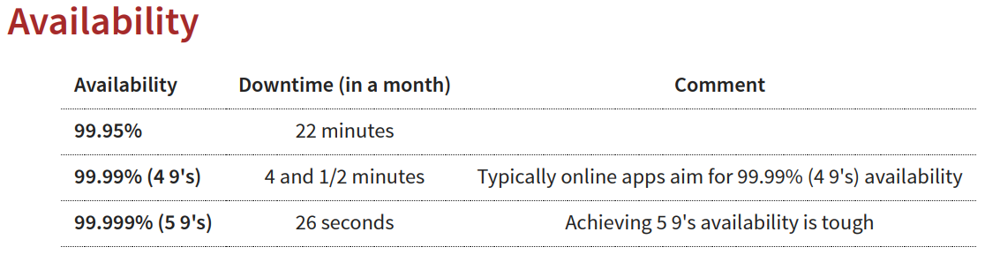

* 持久性 (Durability)
    > 指的是資料庫系統在發生故障時，能夠保證資料不會遺失的能力

    * 衡量指標
    通常用資料遺失的可能性來表示，例如 "零資料遺失" 表示在任何情況下，資料都不會遺失。(durability of eleven 9's(99.999999999) is considered very good)

    * 影響因素
    硬體故障： 磁碟故障導致的資料遺失。
    軟體錯誤： 資料庫軟體本身的缺陷或配置錯誤導致的資料損壞。
    人為錯誤： 操作人員的錯誤操作，例如誤刪資料。
    自然災害： 地震、火災等自然災害導致的機房損壞。

    * 提高持久性的方法
    交易日誌： 使用交易日誌記錄所有對資料庫的變更，以便在發生故障時可以恢復資料。
    資料複製： 將資料複製到多個地點，以避免單點故障導致的資料遺失。
    RAID： 使用 RAID 技術將多個磁碟組合成一個邏輯磁碟，提高資料的可靠性。
    備份和恢復： 定期備份資料庫，以便在發生故障時可以恢復資料。
    異地備份： 將備份資料存儲在不同的地理位置，以應對自然災害等突發情況。

#### RTO VS RPO
> 衡量企業在面臨災害或故障時，系統和資料恢復能力的重要指標

* RTO（Recovery Time Objective，復原時間目標）
指的是從系統或服務中斷到恢復正常運作所需的最長時間。簡單來說，就是企業可以容忍的最長停機時間。
範例:公司將其電子商務網站的 RTO 設定為 2 小時，則表示他們必須在網站故障後的 2 小時內恢復其運作

* RPO（Recovery Point Objective，復原點目標）
在發生災害或故障時，可以容忍遺失的資料量。簡單來說，就是企業可以接受的最大資料遺失量。
範例:公司將其客戶資料庫的 RPO 設定為 1 小時，則表示他們可以接受最多遺失 1 小時的客戶資料

* 常見場景
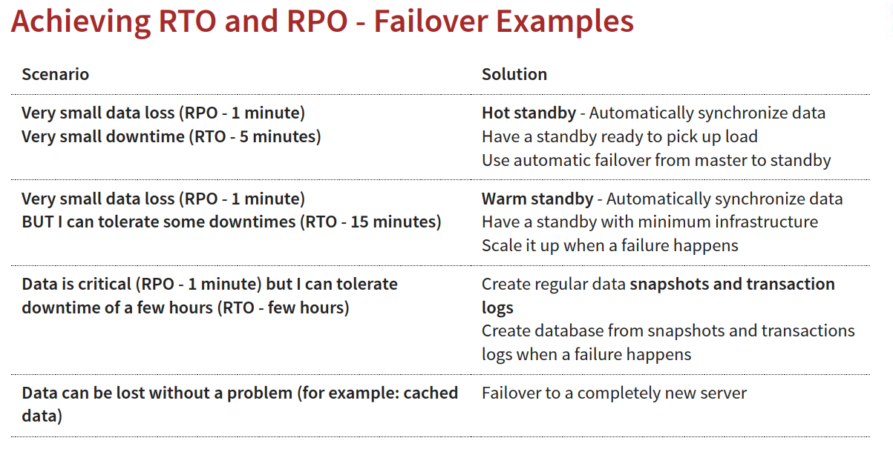

#### 實際案例-2
> 接續實際案例-1，公司決定新建置一個分析報告應用程式並且使用同一個資料庫(READ ONLY)
> 監控幾天後發現資料庫效能受影響，請問該如何解決?
> 1. Vertically scale the database - increase CPU and memory
> 2. Create a database cluster (Distribute the database)(價格昂貴)
> 3. Create read replicas - Run read only applications against read replicas(建議使用)

    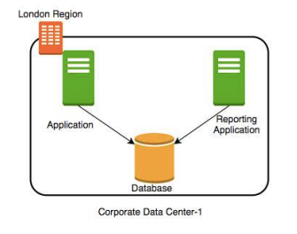

##### 解決步驟-1
> 新增read replica(讀取複本)，分散main database的負擔
> 在不同的regions建立多個read replica
> 最後再從read replica建立snapshot

    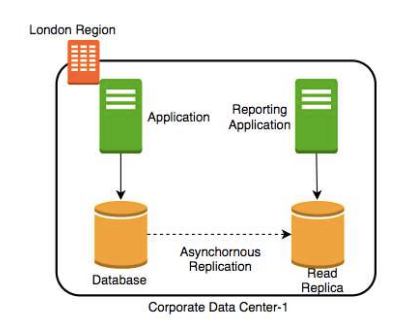

##### 解決步驟-2
> 建立多個read replica後，要如何確保資料的一致性?資料是否有同步更新?

* 一致性(Consistency)

    * 強一致性（Strong Consistency）
    任何讀取操作都將返回最新的資料(Will be slow if you have multiple replicas or standbys)

    * 最終一致性（Eventual Consistency）
    資料最終將會一致但可能存在短暫的延遲，也就是說，你寫入的資料可能需要一段時間才能被其他使用者或甚至你自己的後續讀取操作看到(在延遲期間可能會出現不一致的情況，建議在系統穩定度>資料品質的時候使用)
    常用於社群媒體的貼文、動態更新過一陣子才會被其他使用者看到

    * Read-after-Write consistency
    保證使用者在同一個會話中，寫入的資料可以立即被後續的讀取操作看到。簡單來說，就是你寫入的資料，馬上就能讀取到，不會出現讀取到舊資料的情況(However, updates would have eventual consistency)
    常用於反映使用者操作的應用
    電子商務網站：使用者更改地址、購物車等資訊後需要立即看到更新
    協同編輯工具：多個使用者同時編輯文件時，需要確保每個人都能看到最新的更改
    社交媒體：使用者發布的帖子、評論等需要立即顯示在自己的頁面上

#### 資料庫種類
##### Relational Databases(關聯式資料庫)
> 以表格（Table）的形式組織和儲存資料的資料庫。每個表格由行（Row）和列（Column）組成，行代表一筆記錄（Record），列代表記錄的屬性（Attribute）。表格之間可以通過鍵（Key）建立關聯（Relationship），從而實現資料的關聯性

* 線上交易處理 (OLTP - Online Transaction Processing)
主要設計用於 執行和管理日常的交易導向型應用程式。它的核心目標是 快速、可靠地處理大量的短期交易

* 相關GCP服務
    1. Cloud SQL : Supports PostgreSQL, MySQL, and SQL Server for regional
    relational databases (upto a few TBs)

    2. Cloud Spanner: Unlimited scale (multiple PBs) and 99.999% availability for
    global applications with horizontal scaling

* 線上分析處理 (OLAP - Online Analytical Processing)
側重於 進行複雜的資料分析和查詢，以支援決策制定。它的核心目標是 從大量的歷史資料中提取有價值的資訊和洞見，幫助企業管理者做出更明智的決策

* 相關GCP服務
    1. BigQuery: Petabyte-scale distributed data ware house

##### OLTP VS OLAP
* 兩者的資料結構相同，但儲存方式有很大的區別
* OLTP databases use row storage
    1. Each table row is stored together
    2. Efficient for processing small transactions
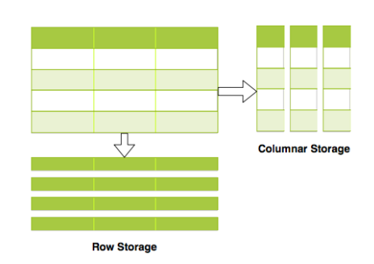

* OLAP databases use columnar storage
    1. Each table column is stored together
    2. High compression - store petabytes of data efficiently
    3. Distribute data - one table in multiple cluster nodes
    4. Execute single query across multiple nodes - Complex queries can be executed efficiently
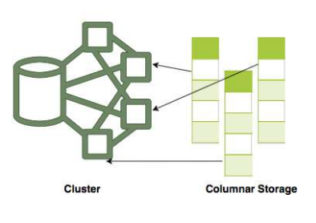
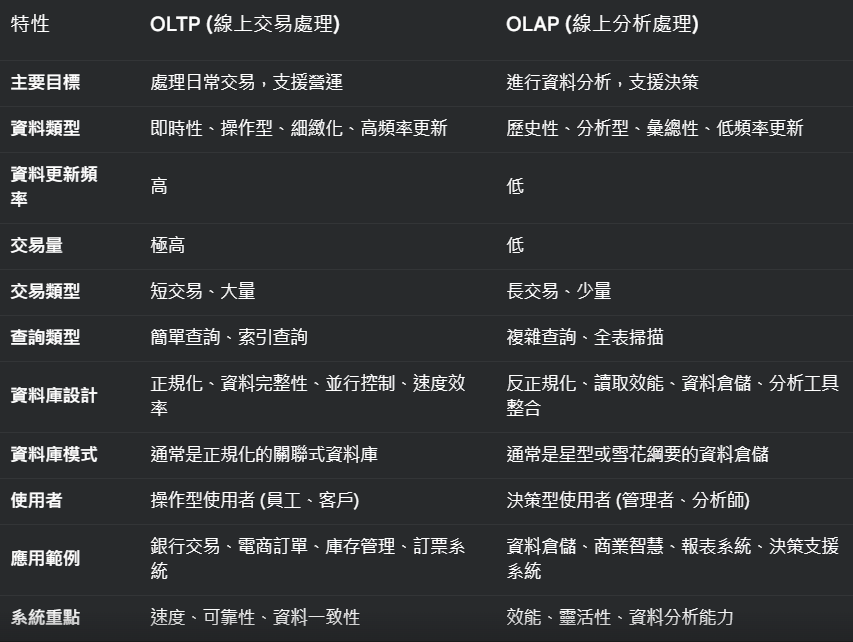

##### NoSQL Databases
> NoSQL 資料庫的出現主要是為了應對現代應用程式在處理 大量非結構化或半結構化資料、以及 需要高擴展性和高可用性 的需求下，傳統關聯式資料庫所面臨的挑戰

* 核心概念
1. 彈性綱要 (Schema-less / Schema-flexible) - NoSQL 資料庫通常不需要預先定義固定的綱要 (Schema)。
    * 資料結構靈活
    你可以儲存不同結構的資料在同一個資料庫中。例如，在一個「使用者」集合中，有些使用者文件可能包含「地址」欄位，有些則沒有，或者不同使用者的「地址」欄位的結構也可能不同。
    * 易於迭代開發
    在應用程式開發過程中，如果資料結構需要變更，NoSQL 資料庫能夠更容易適應，無需像關聯式資料庫那樣進行繁瑣的綱要遷移。
    * 更適合非結構化/半結構化資料
    如 JSON、XML 等格式的資料，可以自然地儲存在 NoSQL 資料庫中，無需像關聯式資料庫那樣需要先轉換成表格結構。

2. 水平擴展 (Horizontal Scalability) - NoSQL 資料庫通常設計為能夠容易地進行水平擴展，也就是透過增加更多的伺服器節點來提升效能和容量。
    * 分散式架構
    NoSQL 資料庫通常採用分散式架構，資料可以分散儲存在多個伺服器上，查詢和寫入操作也可以分散到多個伺服器並行處理。
    * 高吞吐量
    透過水平擴展，NoSQL 資料庫能夠處理非常高的資料讀寫吞吐量，應對高併發訪問的需求。
    * 高可用性
    分散式架構也帶來了更高的可用性，即使部分伺服器節點發生故障，系統仍然可以繼續運作。

3. 多樣化的資料模型 (Diverse Data Models) - NoSQL 資料庫不侷限於關聯模型，而是提供了多種不同的資料模型來適應不同的應用場景
    * 鍵值對 (Key-Value)
    以鍵值對形式儲存資料，類似於雜湊表或字典。
    * 文件 (Document)
    以文件 (例如 JSON, XML) 形式儲存資料，文件可以包含巢狀結構和豐富的資料類型。
    * 欄族 (Column-Family)
    以欄族形式組織資料，資料按欄族和欄儲存，適合儲存稀疏資料。
    * 圖形 (Graph)
    以節點和邊的形式儲存資料，擅長處理複雜的關係資料。

4. 最終一致性 (Eventual Consistency) - 相對於關聯式資料庫通常追求的 ACID (原子性、一致性、隔離性、持久性) 特性，NoSQL 資料庫在分散式環境下，為了追求更高的效能和可用性，有時會犧牲強一致性，採用最終一致性模型
    * CAP 理論
    NoSQL 資料庫的設計通常會根據 CAP 理論進行權衡取捨。CAP 理論指出，在分散式系統中，一致性 (Consistency)、可用性 (Availability)、分割容錯性 (Partition Tolerance) 這三者無法同時兼顧，最多只能同時滿足其中兩項

* 相關GCP服務
    1. Cloud Firestore (Datastore)
    2. Cloud BigTable

##### Relational vs NoSQL
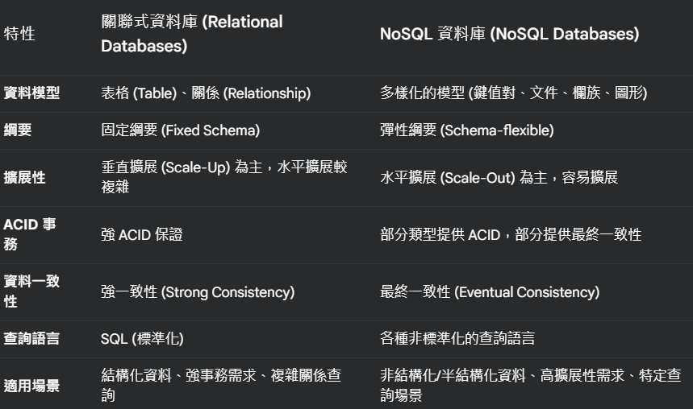

##### 記憶體資料庫(In-memory Database)
> 將資料主要儲存在電腦主記憶體（RAM）而不是傳統硬碟或固態硬碟（SSD）的資料庫系統
> 雖然可以透過持久化機制 (例如快照、日誌) 來減少資料丟失風險，但持久化操作可能會影響效能

* 主要類型
    1. In-memory Data Grid (記憶體資料網格, IMDG)
    將資料分散儲存在多台伺服器的記憶體中，形成一個分散式的記憶體資料庫集群
    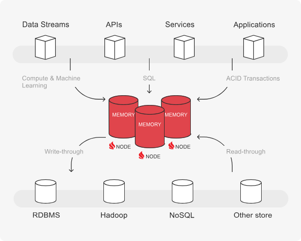

    2. In-memory SQL Database (記憶體 SQL 資料庫)
    提供與傳統關係型資料庫相似的功能，但資料儲存在記憶體中
    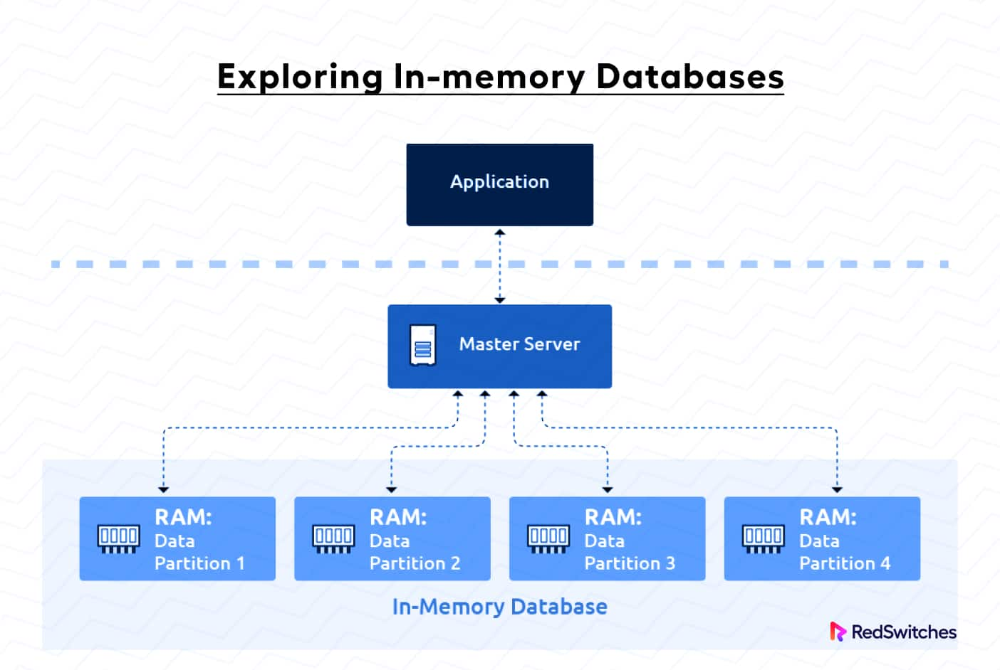

    3. In-memory NoSQL Database (記憶體 NoSQL 資料庫)
    採用 NoSQL 資料模型 (例如鍵值對、文檔、圖形等)，資料儲存在記憶體中
    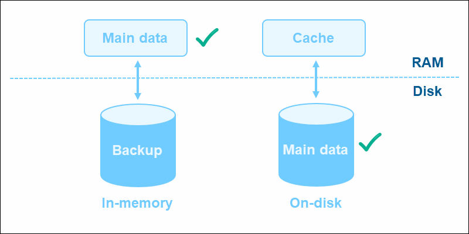

* 主要特色
    1. 快取 (Caching)
    應用程式和後端資料庫之間的快取層，加速資料存取
    2. 即時分析 (Real-time Analytics)
    即時儀表板、欺詐檢測、異常監測
    3. 高速交易處理 (High-Speed Transaction Processing)
    支援極高頻率的交易處理
    4. 會話管理 (Session Management)
    儲存和管理用戶會話資訊
    5. 遊戲排行榜和計分 (Gaming Leaderboards and Scoring)
    即時更新和查詢遊戲排行榜和玩家分數

##### GCP相關服務介紹
###### Cloud Firestore (Datastore)
> Google Cloud Platform (GCP) 提供的一個 NoSQL文件資料庫服務。Cloud Firestore 是 Datastore 的 下一代演進版本，它旨在讓開發者能夠輕鬆地構建、擴展，和管理行動裝置、網頁和伺服器應用程式的資料。
> Firestore 著重於行動與網頁應用程式的即時資料同步、離線存取以及容易擴展的架構
> 建議用於 few TB 等級的資料

* 核心概念
    > Firestore 是一個 文件資料庫，這意味著資料是以 文件 (Documents) 的形式儲存的。這些文件被組織在 集合 (Collections) 中
    1. 集合 (Collections)
    集合是文件的容器。你可以將集合想像成關聯式資料庫中的表格
    集合是組織 Firestore 資料庫的基礎結構
    集合只包含文件，不能直接包含其他集合（但文件可以包含子集合，形成階層結構）

    2. 文件 (Documents)
    文件是實際儲存資料的地方。一個文件就像是 JSON 物件，它包含一組 欄位 (Fields)
    每個文件都有一個 唯一 ID，它在集合中標識該文件
    文件中的欄位可以是各種資料類型，包括字串、數字、布林值、地圖 (map，類似 JSON 物件)、陣列、日期時間、地理位置、以及二進位資料
    文件是 無綱要 (schema-less) 的，這意味著同一個集合中的不同文件可以有不同的欄位，不需要預先定義固定的結構

    3. 子集合 (Subcollections)
    文件可以包含子集合。這允許你創建階層式的資料結構
    例如，一個 "users" 集合中的每個使用者文件，可以有一個 "posts" 子集合，用於儲存該使用者的文章

* 主要特色
    1. 全託管服務(fully managed/serverless)
    2. 離線功能 (Offline Capabilities)
    應用程式可以在離線狀態下繼續存取和修改本地快取的資料。當網路連線恢復時，Firestore SDK 會 自動將本地變更同步到雲端，並處理任何潛在的衝突
    3. 支援 ACID 交易 (Atomicity, Consistency, Isolation, Durability),SQL-like queries, indexes
    4. 強一致性 (預設)

###### Cloud Bigtable
> Google Cloud Platform (GCP) 提供的一個 全託管、可擴展的 NoSQL 寬欄式資料庫服務。它專為處理 大規模資料 和 低延遲存取 而設計，尤其適用於需要 高吞吐量 和 PB 級資料儲存 的應用程式
> Columnar 資料庫將數據按行、區塊儲存，而不是按列存儲。這種儲存方式在進行數據分析(OLAP)時特別有效，尤其是當只需要查詢部分欄位的情況下，因為可以只讀取需要的行而非整列數據
> 大規模、指定欄位、進行彙總操作（如 SUM、AVG、COUNT）的查詢效率高

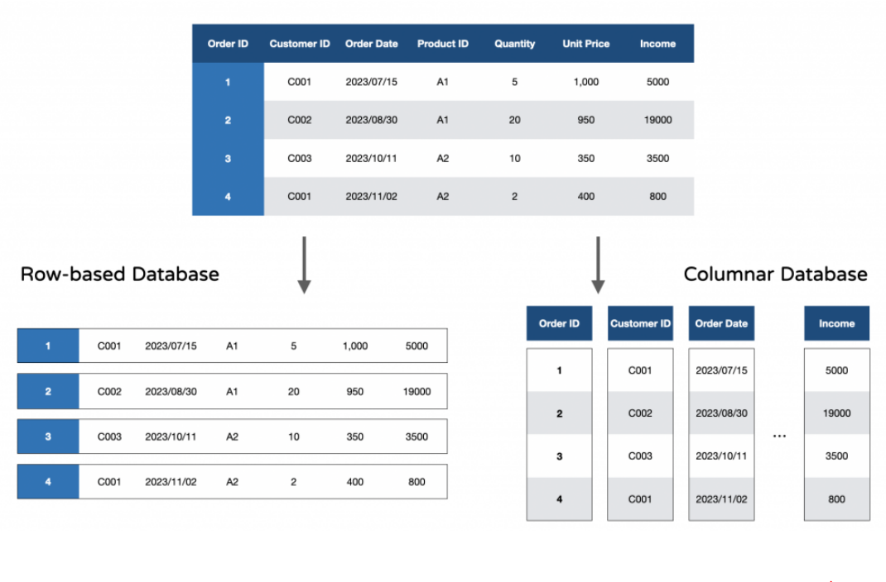

* 核心概念
    1. 表格 (Table):  Cloud Bigtable 中資料的基本組織單位。表格由 列 (Rows) 和 欄 (Columns) 組成。你可以將表格視為資料儲存的容器

    2. 列鍵 (Row Key)
    每個列都由一個唯一的 列鍵 標識。列鍵是表格中資料的索引，也是資料排序的依據
    列鍵是字串且設計至關重要，它直接影響查詢效能和資料分散
    
    3. 欄族 (Column Family)
    欄被組織成欄族。欄族在表格綱要 (Schema) 中定義，它將相關的欄位分組在一起。同一個欄族中的所有欄通常具有相似的存取模式和儲存特性，==欄族需要在表格建立時預先定義，但可以在之後新增欄到現有的欄族==

    4. 欄限定詞 (Column Qualifier):  在欄族中，每個欄都由一個欄限定詞唯一標識。欄限定詞是字串，欄限定詞在欄族內部定義欄的名稱
    例如:在 "personal_info" 欄族中，欄限定詞可以是 "name", "address", "phone_number" 等。

    5. 儲存格 (Cell)
    列、欄族和欄限定詞的交叉點稱為 儲存格。每個儲存格包含 版本化的資料值 (Value)。Cloud Bigtable 中的資料是版本化的，每個值都與一個時間戳記 (Timestamp) 關聯，預設情況下，時間戳記是資料寫入時伺服器端的當前時間，但您也可以在寫入時指定時間戳記

    6. 時間戳記 (Timestamp)
    每個儲存格的版本都由一個 時間戳記 標識。時間戳記是一個 64 位元的整數，通常表示資料版本建立的時間 (以微秒為單位)。時間戳記用於版本控制和資料共時性管理。

* 主要特色
    1. 極高的水平擴展可擴展性
    2. 高效能和低延遲(毫秒級別)
    3. 自動失效 (Automatic Expiration) 策略
    可以根據時間或版本數量自動刪除過期的資料版本

* 適用場景
    1. 時間序列資料
    2. 大數據分析

> **但對於中小規模應用程式，或者需要複雜關聯查詢的場景時，可能不是最佳選擇**
> **資料模型可能比傳統關聯式資料庫更複雜，需要一定的學習曲線**
> **NO Serverless，需手動建置Instance**
> **只能使用 cbt command line tool/HBase commands/java - jar 匯出或匯入資料**
> **建議使用Cloud Dataflow將資料匯入Cloud Storage**

###### Cloud SQL
> Google Cloud Platform 提供的關聯式資料庫全託管服務

* 核心概念
    1. 支援PostgreSQL、MySQL 和 SQL Server
    2. 可使用 Google Cloud Console、gcloud 命令列工具或 Cloud SQL API 來操作
    3. Regional Service providing High Availability (99.95%)
    4. 提供 416 GB of RAM and 30 TB of data storage
    5. Use SSDs or HDDs 

* 主要特色
    1. 自動化任務
    資料加密以及自動執行備份、修補、升級、複寫
    2. 高可用性配置 (High Availability Configuration)
    提供高可用性執行個體選項，確保資料庫在區域故障時仍能持續運作
    記得選擇 Primary and Secondary zones within a region，在同一個 region 建立兩個 instance(但建在不同zone)

    

    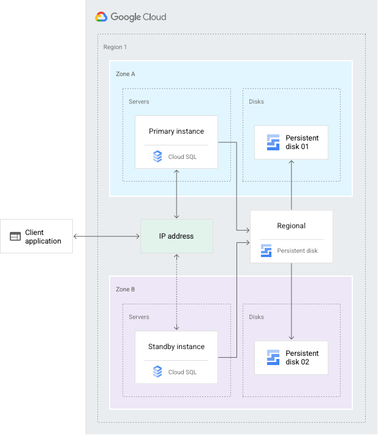
    

    3. 自動故障轉移 (Automatic Failover)
    當主要執行個體故障時，會自動故障轉移到備用執行個體，減少停機時間(需啟用Automated backups and Binary logging)
    4. Automatic storage increase without downtime
    5. Point-in-time recovery(可回復資料到任意時間點，通常有一個時間區間)
    6. Supports migration from other sources
    Database Migration Service (DMS)
    7. Read replicas for read workloads
    支援Cross-zone, Cross-region and External (NON Cloud SQL DB)
    (需啟用Automated backups and Binary logging)

> **讀取複本(Read Replicas)與高可用性(HA)的區別**
> 讀取複本 (Read Replicas): 
> 主要用於提升讀取效能和讀取擴展性，並在一定程度上提高讀取服務的可用性。是非同步複寫，==主要為效能優化和讀取擴展而設計==
> 高可用性 (High Availability - HA): 
> 主要用於確保資料庫在硬體或軟體故障時仍然可以持續運作，提供自動故障轉移和更高的資料庫層級可用性。是同步複寫 (在 HA 配置中)，==主要為資料庫高可用性和災難復原而設計==

###### Cloud Spanner
> Google 提供的全球分散式、可伸縮且強一致性的資料庫服務
> 它結合了傳統關聯式資料庫的結構、SQL 查詢和 ACID 交易，以及 NoSQL 資料庫的水平可擴展性和全球分散能力
> 簡單來說是更強大的Cloud SQL

* 核心概念
    > Cloud Spanner 的底層架構是一個高度分散式的系統
    > high availability (99.999%)，針對PB等級的資料進行分割與儲存

1. Spanner 實例 (Instance)
Spanner 部署的邏輯容器。您可以選擇實例配置，例如區域或多區域，以控制資料的地理位置和可用性
2. Spanner 節點 (Node)
Spanner 實例內的運算單元。您可以根據應用程式的負載增加或減少節點數量
scales horizontally for reads and writes，Cloud SQL不支援 horizontally write
3. 資料分割 (Data Sharding)
Spanner 會自動將資料分割到多個伺服器上，實現水平拓展
4. TrueTime API
一個全球分散式的時鐘服務，確保所有 Spanner 伺服器時間同步，實現強一致性
5. Paxos 分散式共識演算法
用於在分散式環境中達成共識，確保資料的一致性和可靠性

    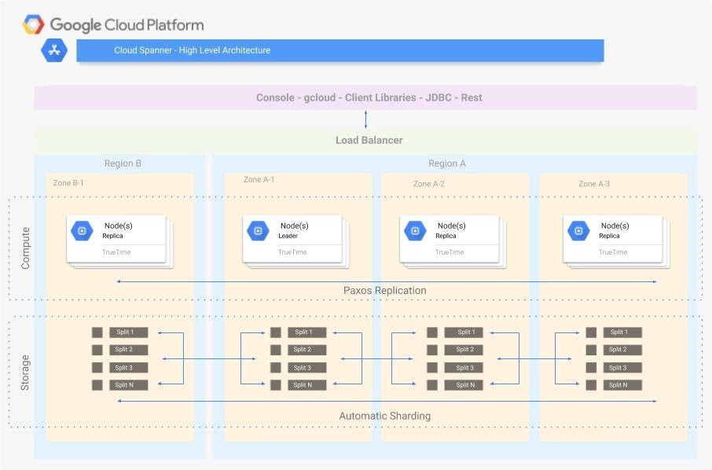

> **資料只能透過Dataflow或cloud console匯出**

###### Cloud Memorystore
> Google Cloud Memorystore 是一項全托管的記憶體內資料庫服務，適用於需要極速資料存取應用程式。它讓您可以輕鬆地在雲端部署和管理 Redis 和 Memcached 執行個體

* 核心功能
1. Redis
是一個更豐富的記憶體內資料結構伺服器，提供多種資料結構（例如字串、雜湊、列表、集合、排序集合）、持久性選項、發布/訂閱功能以及 Lua 腳本
* 使用場景  
    1. 單純的快取層
    最典型的應用場景是作為應用程式和資料庫之間的高速快取層，用於緩存靜態內容、網頁片段、API 回應
    2. 分散式快取
    適用於需要分散式快取解決方案的場景，例如大型網站的會話 (Session) 管理、網頁快取

2. Memcached
是一個簡單但功能強大的分散式記憶體快取系統，專注於最有效率地儲存和檢索簡單的鍵值對
* 使用場景 
    1. 工作階段管理
    儲存使用者工作階段資料
    2. 即時分析
    即時計數器、排行榜、即時儀表板
    3. 地理空間資料索引
    地理空間功能使其適用於地圖應用程式、位置服務

###### BigQuery
> BigQuery 是 Google Cloud Platform (GCP) 上功能強大的全托管、無伺服器、低成本且多雲資料倉儲。 它專為分析巨量資料而設計

* 主要特點
1. PB 級別資料倉儲
儲存各種結構化和半結構化資料，例如 CSV、JSON、Avro 和 Parquet 格式
2. 標準 SQL 查詢
3. 儲存與運算分離
儲存層由 Colossus 管理，運算層由 Dremel 管理
4. 工作 (Jobs)
在 BigQuery 中執行的所有操作 (例如查詢、資料載入、資料匯出) 都稱為工作。您可以通過 Google Cloud Console、BigQuery Rest API、、bq command-line tool 或 Client Libraries(HBase API based) 提交工作
5. Query external data sources without storing data in BigQuery
(Cloud Storage, Cloud SQL, BigTable, Google Drive )

> **執行BigQuery查詢前必須先評估資料大小，以免費用爆掉**
> Use UI(console)/bq(--dry-run) - Get scanned data volume
> Use Pricing Calculator: Find price for scanning 1 MB data calculate cost

###### GCP 資料庫操作介面統整
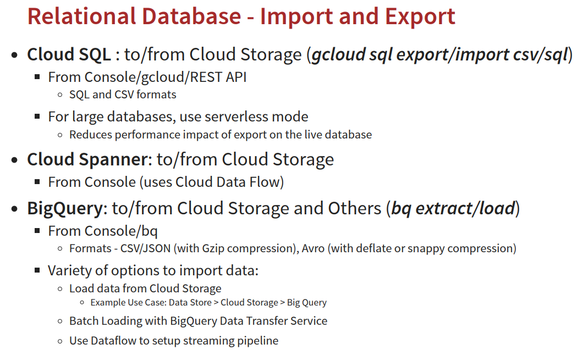
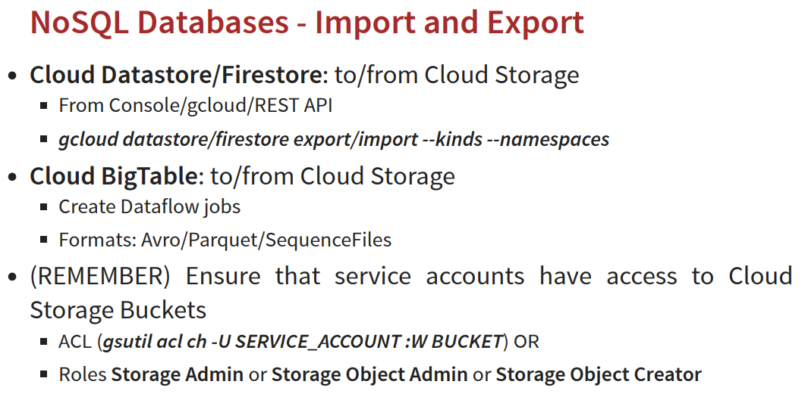

#### 常見場景
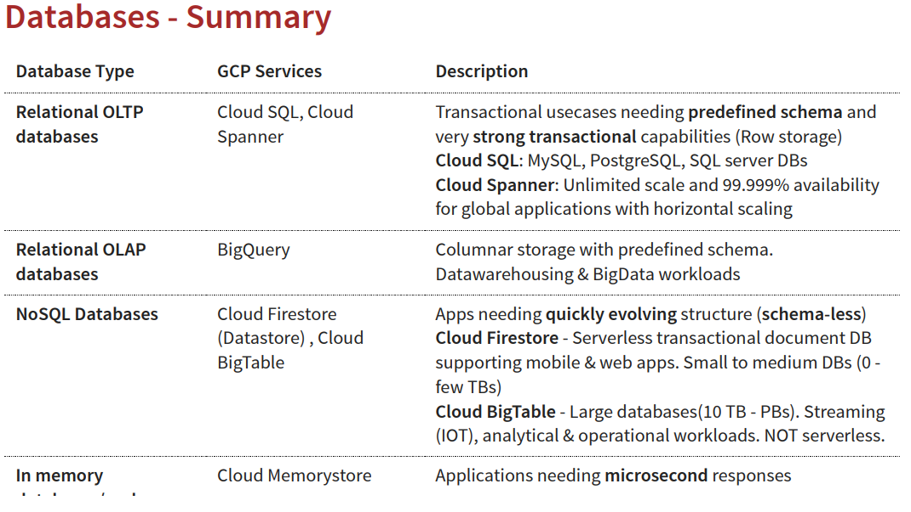
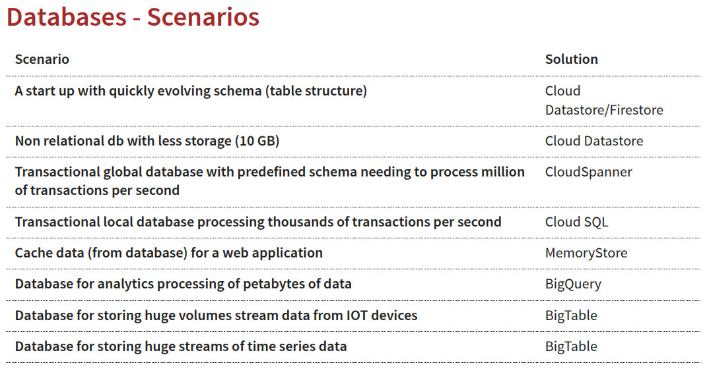

#### 常見指令
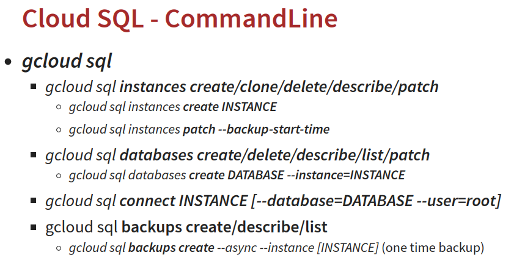
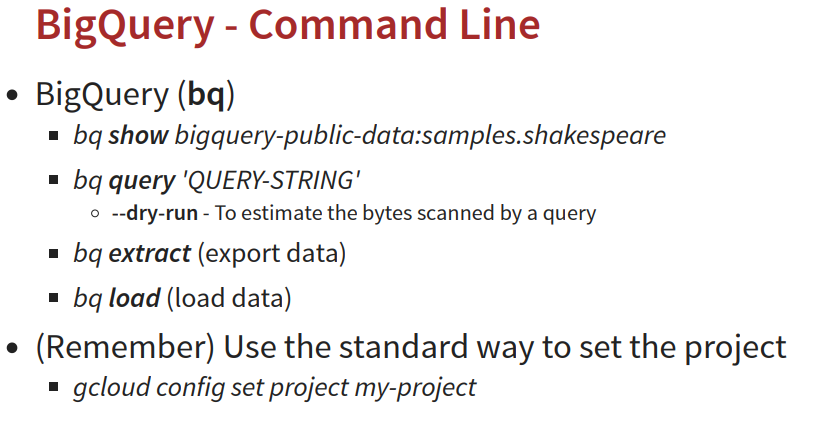
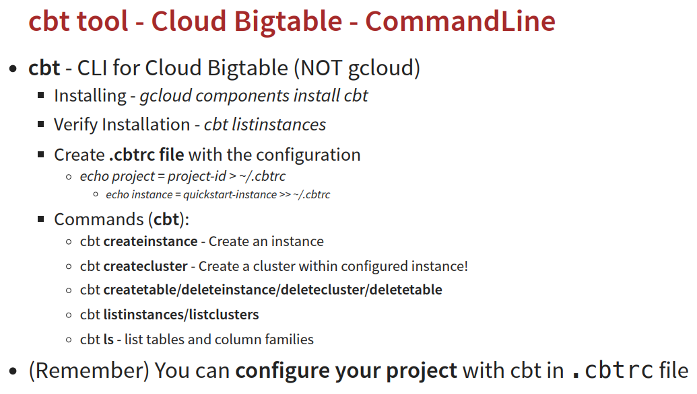

