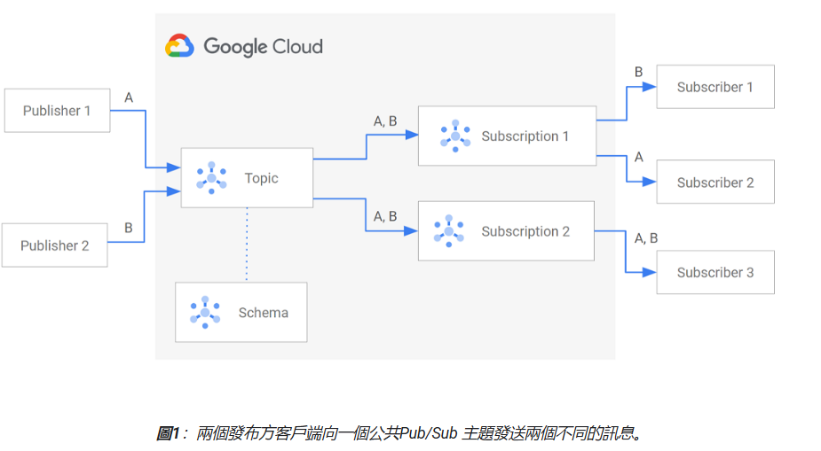
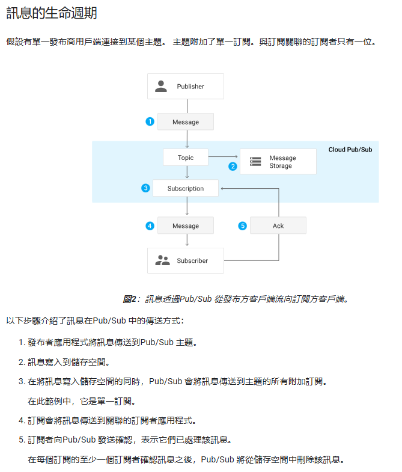
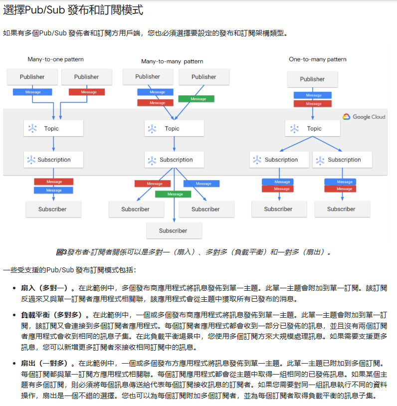
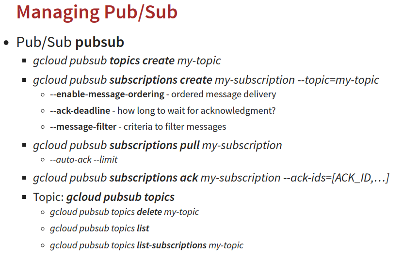

# Decoupling Applications with Pub/Sub
## 介紹
### 同步/異步介紹
#### 同步(Synchronous)
> 想像一下您在餐廳點餐的情景：
> 您走到櫃檯，點餐並等待服務員處理您的訂單。
> 服務員接收您的訂單，然後開始準備餐點。
> 在服務員準備餐點的過程中，您必須在櫃檯等待，直到餐點準備好。
> 服務員將餐點交給您，您才能離開櫃檯去做其他事情（例如找座位或開始用餐）。
> 在這個情景中，點餐和餐點準備是一個同步的過程。您的行動（點餐）必須等待另一個行動（餐點準備完成）結束才能繼續進行。

* 主要特點
    1. 循序執行 (Sequential Execution)
    作業按照它們被調用的順序一個接一個地執行
    2. 等待結果 (Blocking)
    當一個同步作業被調用時，程式或執行緒會被阻塞 (blocked) 或暫停 (paused)，直到這個作業完成並返回結果。在這段時間內，程式或執行緒不能執行任何其他任務
    3. 結果即時可用 (Immediate Result Availability)
    一旦同步作業完成，結果會立即返回給調用者。

* 缺點
    1. 效能瓶頸 (Performance Bottleneck)
    當作業需要長時間等待（例如網路請求、檔案讀寫）時，同步作業會導致程式或執行緒被阻塞，浪費 CPU 資源，降低整體效能
    2. 使用者體驗差 (Poor User Experience)
    在需要使用者介面的應用程式中，同步作業如果處理耗時的操作，可能會導致應用程式看起來「卡頓」或「沒有反應」

#### 異步(Asynchronous)
> 讓我們再次回到餐廳點餐的情景，但這次是使用號碼牌的方式：
> 您走到櫃檯點餐，服務員接收您的訂單並給您一個號碼牌。
> 您可以自由地去做其他事情（例如找座位、瀏覽菜單、與朋友聊天），不需要在櫃檯等待餐點準備。
> 服務員在後廚準備餐點，這是一個獨立的過程，與您無關。
> 當餐點準備好時，服務員會叫您的號碼。
> 您聽到叫號後，回到櫃檯領取餐點。
> 在這個情景中，點餐和餐點準備是一個異步的過程。您點餐後，不需要等待餐點準備完成，就可以繼續做其他事情。餐點準備好時，會通過某種方式（叫號）通知您。

* 主要特點
    1. 非循序執行 (Non-Sequential Execution)
    作業的調用和結果的接收是分開的。調用者發起一個異步作業後，可以立即繼續執行其他任務，而不需要等待作業完成
    2. 非阻塞 (Non-Blocking)
    當一個異步作業被調用時，程式或執行緒不會被阻塞。調用者可以繼續執行其他任務，並在稍後通過某種機制（例如回調函數、Promise、Async/Await）接收作業完成的通知和結果
    3. 結果延遲可用 (Delayed Result Availability)
    異步作業的結果不會立即返回。調用者需要在作業完成後，通過特定的機制來接收結果。

* 缺點
    1. 程式碼複雜性增加=>除錯難度增加=>理解門檻較高

### GCP Pub/Sub
> Pub/Sub 是一個強大且高度擴展的 異步消息服務，它讓您可以建立鬆耦合、事件驅動的系統
> 簡單來說，Pub/Sub 就像一個 郵局 或 公告欄 系統，但它是為了數位訊息而設計的。它允許不同的應用程式和服務以 異步 的方式交換訊息，而無需彼此直接了解

    

#### 核心概念
1. 主題 (Topic)
主題是一個命名的資源，代表一個訊息通道。發布者將訊息發送到主題，而訂閱者則訂閱主題以接收訊息
想像一個 公告欄，發布者將訊息「張貼」到公告欄上。主題本身並不儲存訊息，它的主要作用是接收來自發布者的訊息，並將這些訊息 路由 給所有已訂閱該主題的訂閱者

2. 發布者 (Publisher)
發布者是 應用程式或服務，負責 將訊息發送到 Pub/Sub 主題
發布者不需要知道有哪些訂閱者，也不需要關心訊息如何被處理。它們只需專注於 產生訊息 並將其發布到適當的主題

3. 訂閱者 (Subscriber)
訂閱者是 應用程式或服務，負責 從 Pub/Sub 訂閱接收訊息
訂閱者訂閱一個或多個主題，並從這些訂閱中 接收訊息。訂閱者需要 確認處理 (Acknowledge) 已接收的訊息，以告知 Pub/Sub 服務訊息已成功處理，可以從訂閱中移除。如果訂閱者沒有在一定的時間內確認處理訊息，Pub/Sub 會 重新傳遞 訊息

4. 訂閱 (Subscription)
訂閱是一個 命名的資源，代表一個 從特定主題接收訊息的通道。訂閱會 連結到一個主題，並定義了如何將該主題的訊息傳遞給訂閱者
訂閱者必須先 訂閱 一個主題，才能接收到該主題發布的訊息。訂閱 儲存 來自主題的訊息，直到訂閱者成功接收並確認處理 (Acknowledged) 訊息

5. 訊息(Message)
訊息是發布者發送到主題的 數據單位。訊息包含 數據有效負載 (Payload) 和 屬性 (Attributes)
訊息的有效負載可以是任何格式的數據（例如 JSON、文本、二進制數據）。屬性是用於描述訊息的鍵值對，可以被訂閱者用來過濾或路由訊息

    

#### Pub/Sub 的運作流程
1. 發布者發送訊息
發布者應用程式將訊息發送到特定的 Pub/Sub 主題。
2. Pub/Sub 路由訊
 Pub/Sub 服務接收到訊息後，會根據主題的訂閱關係，將訊息 複製 並 路由 到所有已訂閱該主題的 訂閱 中。
3. 訂閱者接收訊息
訂閱者應用程式從其訂閱中 拉取 (Pull) 或 推送 (Push) 訊息。
    * 拉取訂閱 (Pull Subscription): 訂閱者主動向 Pub/Sub 服務 請求 訊息。訂閱者可以控制訊息接收的頻率和數量。
    * 推送訂閱 (Push Subscription): Pub/Sub 服務在有新訊息到達時，主動推送 訊息到訂閱者指定的 HTTP 端點。

    

4. 訂閱者確認處理 (Acknowledge) 訊息
訂閱者在成功處理訊息後，需要向 Pub/Sub 服務發送 確認處理 (Acknowledgement)。Pub/Sub 收到確認後，才會將訊息從訂閱中移除。
5. 訊息持久性 (Message Persistence)
Pub/Sub 預設會將訊息 持久儲存 一段時間（例如 7 天），即使訂閱者暫時離線，訊息也不會丟失。當訂閱者重新連線後，仍然可以接收到之前發布的訊息。

#### 主要特點
1. 異步和解耦 (Asynchronous & Decoupled)
發布者和訂閱者之間不需要直接互相了解，它們僅通過主題進行間接通信。這降低了系統組件之間的依賴性，提高了系統的 靈活性 和 可維護性

2. 可靠性 (Reliability)
    * 訊息持久性
    Pub/Sub 會將訊息持久儲存，即使應用程式或系統故障，訊息也不會丟失。
    至少一次傳遞 (At-least-once Delivery): Pub/Sub 保證訊息 至少會被傳遞給每個訂閱者一次。在某些極端情況下，可能會發生重複傳遞 (at-least-once)，應用程式需要設計成 冪等性 (Idempotent)，以應對重複訊息。
    * 訊息重新傳遞和死信隊列 (Message Redelivery & Dead-letter Queues)
    如果訂閱者未能成功處理訊息 (例如未確認處理或處理失敗)，Pub/Sub 會 重新傳遞訊息。如果訊息多次重新傳遞仍然處理失敗，可以將訊息轉移到 死信隊列 (Dead-letter Queue) 進行後續分析和處理。

3. 訊息過濾和排序 (Message Filtering & Ordering, 部分支援)
Pub/Sub 支援基於訊息屬性的 過濾 功能 (針對推送訂閱)。部分場景下，可以實現 訊息排序 (需要配置 ordered topics)

#### 常見指令

    

