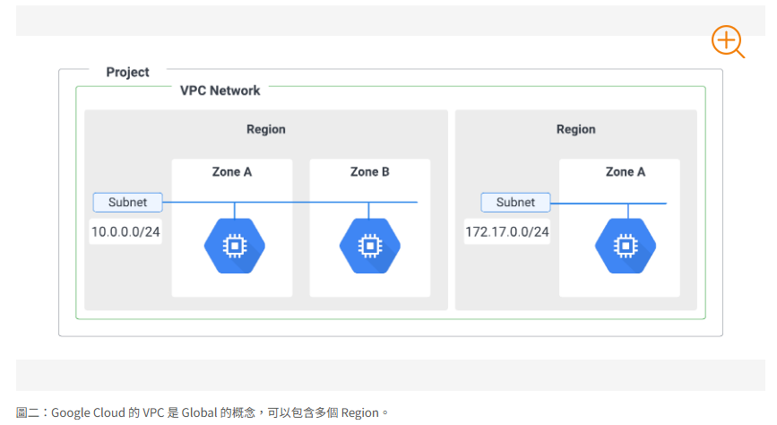
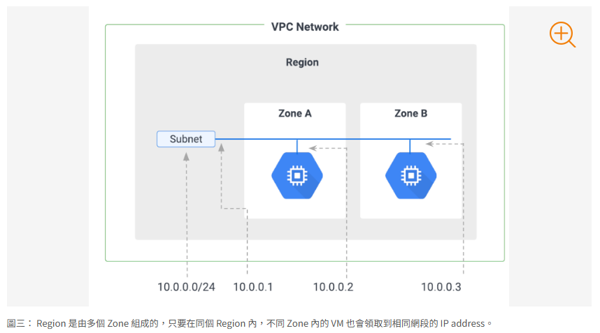

# Google Cloud VPC(Virtual Private Cloud)
## 介紹
### Google Cloud VPC
> Google Cloud VPC 讓您可以在 Google Cloud 中佈建和管理一個虛擬網路，這個網路在邏輯上與其他虛擬網路隔離。您可以完全掌控您的 VPC 網路，包括選擇自己的 IP 位址範圍、建立子網路、設定路由和防火牆規則

#### VPC 的主要組成部分
##### VPC 網路 (VPC Network)
> 這是 VPC 的基礎，代表一個全球性的虛擬網路。 雖然概念上是全球性的，但資源（例如虛擬機器執行個體）實際上部署在特定的區域和可用區中

    

* 可以建立多個 VPC 網路，每個網路都是邏輯上隔離的
* VPC 網路本身不與任何特定區域相關聯，但子網路是區域性的
* 在一個 VPC 網路中建立的資源可以相互私下通訊，只要它們在同一個 VPC 網路內，無論它們位於哪個區域
* 預設情況下，新建立的 Google Cloud 組織會包含一個名為 default 的 VPC 網路。這個預設網路已經預先配置好子網路、路由和防火牆規則

* VPC Network 模式設定
    1. Default
    開啟 Google Cloud 的專案的時候，就會自動開啟一個 Default Network 給我們來使用，它會在每個 Region 上幫助我們配置子網路（Subnet），以及有預設的 Firewall rule\

    2. Auto Mode
    Default VPC Network 其實就是用 Auto mode 來設置的，它幫我們在每個Region 上配置子網，預設 Subnetwork 是 /20，最多可以到 /16

    3. Custom Mode：這個模式就是全部自己手動設定，不會在任何 Region 配置任何網段，建議的網段是 RFC 1918 的範圍，就是一般的私有網路網段

##### 子網路 (Subnet)
> 子網路是 VPC 網路內部的 IP 位址範圍分割。每個子網路都與一個特定的區域(Region)相關聯

    

**VPC 總共會保留 4 個 IP address**
https://cloud.google.com/vpc/docs/subnets?hl=zh-cn#reserved_ip_addresses_in_every_subnet

    

* 必須在 VPC 網路中建立至少一個子網路才能在其中部署資源
* 如何在VPC中切開公開資源和私有資源的差異?
=> 各別建立子網路
* 子網路定義了資源可以使用的 IP 位址範圍 (CIDR 區塊)
* 在同一個 VPC 網路中，不同區域的子網路可以互相連線，就像在同一個實體網路的不同區段一樣
* 不同 Region 內的資源，只要他們在同個 VPC Network 內，就可以透過內網 IP 來互相拜訪到對方
* 公開子網才能接觸到外網，但公開子網也能和私有子網溝通
* Private Google Access - Allows VM's to connect to Google API's using private IP's
* FlowLogs - To troubleshoot any VPC related network issues

###### 子網路類型
1. 區域子網路 (Regional Subnet)
資源部署在指定的區域內，並且可以跨越該區域內的所有可用區。這是最常見的子網路類型

2. 舊版子網路 (Legacy Subnet)
與特定區域無關聯，屬於較舊的 VPC 網路類型，通常不建議在新專案中使用

###### CIDR (Classless Inter-Domain Routing) Blocks
> CIDR 是一種 IP 位址分配方法，它取代了早期的類別網路系統 (A, B, C 類別)。CIDR 的核心概念是無類別，這意味著它不再受限於固定的網路類別邊界，可以更精確地劃分和分配 IP 位址空間

IP相關知識待補...

##### 防火牆規則 (Firewall Rules)
> 防火牆規則控制進出 VPC 網路的流量。它們在 VPC 網路層級進行配置，並應用於該網路中的所有執行個體

* 可以定義規則來允許或拒絕特定協定、埠和來源/目標 IP 範圍的流量
* 防火牆規則是有狀態的 (Stateful)，這意味著如果允許從外部到您的執行個體的連線，則允許對應的回應流量返回外部，即使沒有明確的傳出規則允許它
* 預設防火牆規則
    1. default-allow-internal: 允許同一個 VPC 網路內執行個體之間的內部流量
    2. default-allow-ssh: 允許從任何來源到執行個體的 SSH 連線
    3. default-allow-icmp: 允許從任何來源到執行個體的 ICMP (ping) 流量
    4. default-deny-ingress: 拒絕所有來自外部的傳入流量 (除非有明確的允許規則)
    5. default-allow-egress: 允許所有從執行個體到外部的傳出流量

##### 路由 (Routes)
> 路由決定了網路流量的路徑。VPC 網路會使用路由表來決定如何將封包從一個執行個體轉發到另一個執行個體，或轉發到網際網路或其他網路

* 每個 VPC 網路都有一個預設路由表，其中包含一些預設路由
* 您可以建立自訂路由 (Custom Routes) 來覆蓋預設路由，或者添加更特定的路由規則
* 常見路由
    1. 預設網際網路路由 (Default Internet Route)
    將目標為 0.0.0.0/0 (任何外部 IP 位址) 的流量路由到網際網路閘道 (Internet Gateway)。這是允許執行個體連線到網際網路的必要路由

    2. 內部子網路路由 (Internal Subnet Route)
    自動為每個子網路建立，允許同一個 VPC 網路內執行個體之間的內部流量

    3. 自訂靜態路由 (Custom Static Route)
    您手動建立的路由，可以指定下一個躍點 (例如，另一個執行個體、VPN 閘道或網際網路閘道) 和目標 IP 範圍

    4. 自訂動態路由 (Custom Dynamic Route)
    使用 Cloud Router 動態學習和發布路由，通常用於連接到內部部署網路或其他雲端網路 (例如，透過 Cloud VPN 或 Cloud Interconnect)

##### 閘道 (Gateways)
> 閘道是 VPC 網路連線到外部網路的入口點

* 常見閘道
    1. 網際網路閘道 (Internet Gateway)
    允許 VPC 網路中的執行個體連線到網際網路。執行個體需要具有外部 IP 位址才能透過網際網路閘道連線到網際網路

    2. Cloud VPN 閘道 (Cloud VPN Gateway)
    建立 VPC 網路與內部部署網路之間的 VPN 連線。Cloud VPN 閘道是 VPN 連線的端點，它負責加密和解密 VPN 流量

    3. Cloud Interconnect 閘道 (Cloud Interconnect Gateway)
    建立 VPC 網路與內部部署網路之間的高頻寬、低延遲的專線連線。Cloud Interconnect 閘道是專線連線的端點

    4. NAT 閘道 (NAT Gateway)
    允許沒有外部 IP 位址的執行個體連線到網際網路。NAT 閘道會將內部 IP 位址轉換為 NAT 閘道的外部 IP 位址，使得執行個體可以發起對外連線，但無法從網際網路直接連入

#### 常見使用案例
* 託管 Web 應用程式
可以使用 VPC 來託管公開的 Web 應用程式。您可以將 Web 伺服器放在公開的子網路中，並使用防火牆規則限制對其的存取

* 多層應用程式
可以使用 VPC 來建構多層應用程式，例如具有 Web 前端、應用程式伺服器和資料庫後端的應用程式。您可以將不同的層部署在不同的子網路中，並使用防火牆規則控制層之間的通訊

* 擴充內部部署網路到雲端 (混合雲)
可以使用 VPC 來擴充您的內部部署網路到 Google Cloud。透過 Cloud VPN 或 Cloud Interconnect，您可以建立安全且高頻寬的連線，讓內部部署資源和雲端資源可以互相通訊

* 連接不同的專案
如果您有多個 Google Cloud 專案，您可以使用 Shared VPC 或 VPC Network Peering 來安全地連接這些專案的 VPC 網路，以便資源可以跨專案互相通訊，而無需經過公網

    

