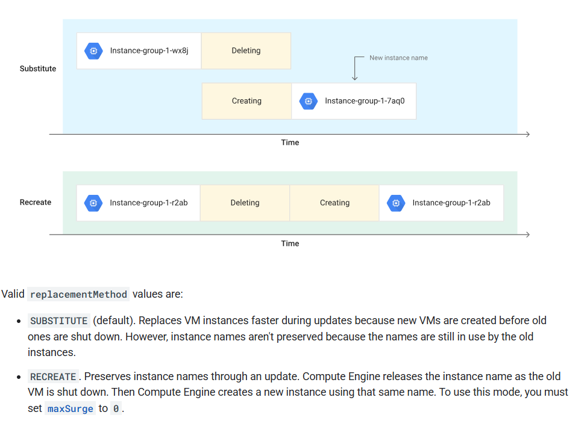
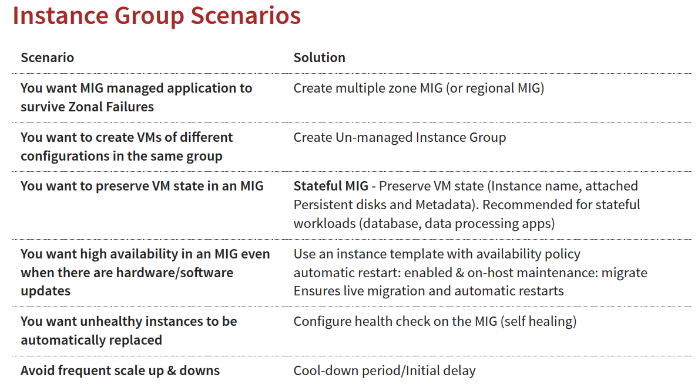

# Intance Group
## 管理一堆擁有相似生命週期的VM，把這些VM當作一個單位管理

### 兩種instance group:
* Managed Instance Groups (MIGs):  ==MIGs 是由 GCP 管理的實例群組，提供**自動擴展、自動修復、滾動更新和負載平衡等功能**。MIGs 適合用於部署需要高可用性和可擴展性的應用程式==
* Unmanaged Instance Groups (UMIGs): ==UMIGs 是由你自行管理的實例群組，**提供基本的群組功能(沒有migs的特點)**，例如將實例添加到群組、從群組中移除實例以及應用共同的網路和儲存設定。UMIGs 適合用於需要將實例組合在一起進行管理，但不需要自動擴展或負載平衡的應用程式==

### Managed Instance Groups (MIGs)特色
* 當實例crash時自動啟動新實例
* 自我檢測實例運行的健康狀況(__self healing__)
* 根據loading調整實例數量(__Auto Scaling__)
* 將流量分散到多個後端，例如虛擬機器、容器或無伺服器端點。這有助於提高應用程式的可用性、效能和擴展性(__Load Balancer__)
* instance group可以設定使用region或zone(建議使用Regional, gives you higher availability)

#### 區域性 Instance Group (Regional MIG): 
1.**實例分佈**: 實例分散在區域內的多個地區。
2.**可用性**: 提供更高的可用性，因為即使一個地區發生故障，其他地區的實例仍然可以繼續運行。
3.**容錯能力**: 更強的容錯能力，可以抵禦地區級故障。
4.**適用場景**: 需要高可用性和容錯能力的應用程式，例如關鍵任務應用程式、資料庫等。

#### 地區性 Instance Group (Zonal MIG):
1.**實例分佈**: 所有實例都位於同一個地區。
2.**可用性**: 可用性受限於單個地區，如果該地區發生故障，所有實例都將受到影響。
3.**容錯能力**: 容錯能力較低，無法抵禦地區級故障。
4.**適用場景**: 對可用性和容錯能力要求較低的應用程式，例如開發和測試環境、批次處理任務等。

### 零時差更新程式版本
#### Rolling updates:==逐步更新應用程式或服務的方式(對版本穩定有較高的把握)==
通過逐步將新版本的應用程式部署到生產環境，同時逐步淘汰舊版本來實現。
* 優點:
    1.__最小化停機時間__: 通過逐步更新(**基於實例數目設定數量**)，應用程式或服務可以持續可用，幾乎沒有停機時間。
    2.__降低風險__: 分階段部署新版本允許你在早期階段檢測和解決問題，並在出現嚴重問題時快速回滾，從而降低風險。
    3.__易於回滾__: 如果新版本出現問題，可以輕鬆快速地回滾到舊版本。
    4.__提高發布頻率__: 更低的風險和更短的停機時間使你能夠更頻繁地發布新版本。
    5.__資源利用率__: Rolling Updates 可以有效利用資源，因為它只在需要時才創建新實例。

#### Canary Deployment:==先將新版本的應用程式或服務部署到一小部分使用者或伺服器，在確認其穩定性和效能後，再逐步擴大部署範圍到所有使用者(對版本穩定沒有把握)==
* 優點：
    1.**風險最小化**: 通過將新版本先部署到小範圍(**基於流量百分比設定比例**)，可以在早期發現和解決問題，避免影響所有使用者。
    2.**快速回滾**: 如果在 Canary 階段發現問題，可以快速輕鬆地回滾到舊版本，將影響降到最低。
    3.**真實環境測試**: Canary Deployment 讓新版本可以在真實的生產環境中接受考驗，而不是僅僅在測試環境中。
    4.**A/B 測試**: Canary Deployment 可以作為 A/B 測試的基礎，比較新舊版本在真實使用者下的表現。

### Create MIG 注意事項
* 強制使用instance template
* autoscaling 會基於負載情況調整vm instance數量
1. **設定最大/最小的instance數量**
2. **autoscaling metric**: 透過Stack Driver上的CPU使用率或流量負載器等等指標來決定是否增加或簡上instance
    * **cool-down period**: 多久的時間檢查一次autoscaling metric
    * **scale in control**: 防止突然間大量的instance減少(設定在 5 分鐘內最多縮減 10% 或 3 個實例) 
3. **Autohealing**: 確保應用程式正常可用
    * 自動健康檢查 (Automatic Health Checks)： MIG 可以定期向 VM 發送請求（例如 HTTP 請求），檢查 VM 是否有回應。 如果 VM 沒有回應或回應不正確，MIG 就會認為該 VM 不健康
    * 應用程式型健康檢查 (Application-based Health Checks)： 除了基本的健康檢查，你還可以設定更進階的應用程式型健康檢查。 這種檢查可以更深入地檢查 VM 上運行的應用程式是否正常運作，例如檢查特定的網路端口或應用程式日誌。

### Updating MIG 注意事項
* Rolling update: 參考上方說明
    1. Maximum surge: 更新時最多可以新增多少instance(set to 2，代表更新時最多有可以有N+2個instance運行)
    2. Max Unavailable: 在更新時有多少instance可以離線作業
    3. 

* Rolling Restart/replace: 更新 Managed Instance Group (MIG) 中虛擬機 (VM) 的方法，它可以在最小化停機時間的同時，將更新部署到你的應用程式
    1. Restart 在不改動instance template的前提下重啟vm
    2. Replace 在不改動instance template的前提下，建立新的 VM，並將舊的 VM 刪除
    

* 使用場景
    1. 清除記憶體洩漏
    2. 重新啟動您的應用程式，以便它可以從全新的機器上運行
    3. 更新vm作業系統或使用startup script更新軟體
    4. Apply a periodic replace as a best practice to test your VMs.

### MIG常用命令
* Create instance group: create
```{.line-numbers}
gcloud compute instance-groups managed create my-mig --zone us-central1-a --template myinstance-template --size 1

補充:
--health-check=HEALTH_CHECK: How do you decide if an instance is healthy?
--initial-delay: How much time should you give to an instance to start?
Other similar commands - gcloud compute instance-groups managed delete/describe/list
```

* Setup Autoscaling: set-autoscaling/stop-autoscaling
```{.line-numbers}
gcloud compute instance-groups managed set-autoscaling my-mig --max-num-replicas=10

補充:
--cool-down-period (default - 60s): How much time should Auto Scaler wait after initiating an autoscaling action?
--scale-based-on-cpu --target-cpu-utilization --scale-based-on-load-balancing --target-load-balancing-utilization
--min-num-replicas --mode (off/on(default)/only-scale-out)
gcloud compute instance-groups managed stop-autoscaling my-mig
```

* Update existing MIG policies (ex: auto healing policies)
```{.line-numbers}
gcloud compute instance-groups managed update my-mig
--initial-delay: How much time should you give to the instance to start before marking it as unhealthy?
--health-check: How do you decide if an instance is healthy?
```
* Resize the group:
```{.line-numbers}
gcloud compute instance-groups managed resize my-mig --size=5
```

* Recreate one or more instances (delete and recreate instances)
```{.line-numbers}
gcloud compute instance-groups managed recreate-instances my-mig --instances=myinstance-1,my-instance-2
```

* Update specific instances
```{.line-numbers}
gcloud compute instance-groups managed update-instances my-mig --instances=my-instance3,my-instance-4 (Update specific instances from the group)

補充:
--minimal-action=none(default)/refresh/replace/restart
--most-disruptive-allowed-action=none(default)/refresh/replace/restart
=> 決定了 MIG 在更新 VM 時可以採取的最激烈的行動
程度分級:replace > restart > refresh
```

* Update instance template:
```{.line-numbers}
gcloud compute instance-groups managed set-instance-template my-mig --template=v2-template

補充:
將名為 "my-mig" 的 managed instance group 的 instance template 更新為 "v2-template"。 這意味著，之後 my-mig 中新創建的 VM 都將使用 "v2-template" 中定義的配置
After updating instance template, you can trigger roll out of the new template using update-instances, recreate-instances or rolling-action start-update commands
```

* 你想要把程式從v1升級至v2且不要有無法使用的空窗期

gcloud compute instance-groups managed rolling-action ......
>
roll-action有4種不同的操作:
replace: 同上說明
restart: 同上說明
start-update: 開始滾動更新。 你需要指定要更新的 MIG 和要使用的 instance template。 你還可以設定其他參數，例如 max-unavailable (允許的最大不可用 VM 數量) 和 min-wait-time (每個 VM 更新完成後，等待多長時間才開始更新下一個 VM)。
stop-proactive-update: 停止正在進行的滾動更新。
list: 列出 MIG 的滾動更新記錄。

* Restart(stop & start)
```{.line-numbers}
gcloud compute instance-groups managed rolling-action restart mymig

補充:
--max-surge=5 or 10%
```

* Replace(delete & recreate)
```{.line-numbers}
- gcloud compute instance-groups managed rolling-action replace my-mig

補充:
--max-surge=5 or 10% (Max no of instances updated at a time)
--max-unavailable=5 or 10% (Max no of instances that can be down for the update)
--replacement-method=recreate/substitute (substitute (default) creates instances with new names. recreate
reuses names)
```

* Updates instances to a new template
```{.line-numbers}
Basic Version (Update all instances slowly step by step):
gcloud compute instance-groups managed rolling-action start-update my-mig --version=template=v1-template 
```

```{.line-numbers}
Canary Version (Update a subset of instances to v2):
gcloud compute instance-groups managed rolling-action start-update my-mig --version=template=v1-template --canary-version=template=v2-template.target-size=10%
```

* 情境:I want to ensure that I have one healthy instance running all the time
```{.line-numbers}
gcloud compute instance-groups managed set-autoscaling my-group --max-numreplicas=1
```

* 情境:I want to make a new release with no reduction in available number of instances. I want to update one instance at a time
```{.line-numbers}
gcloud compute instance-groups managed rolling-action start-update my-group --version=template=my-v1-template --max-surge 1 --max-unavailable 0
```

### 常見場景整理



