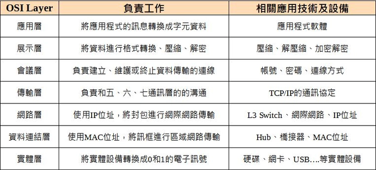
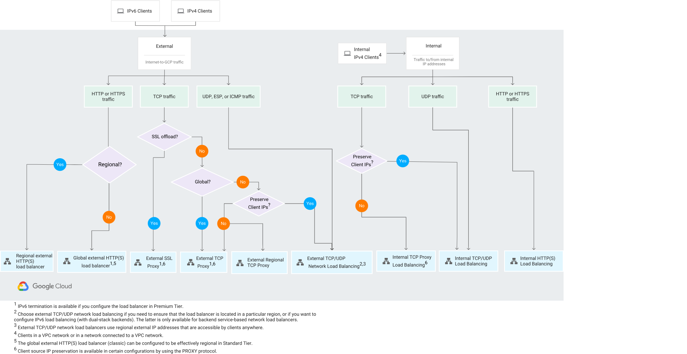
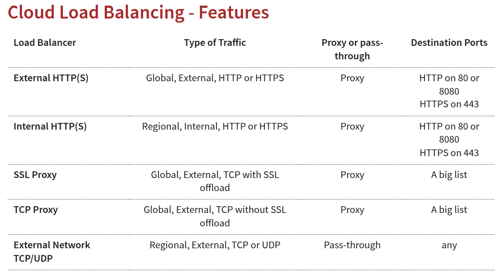
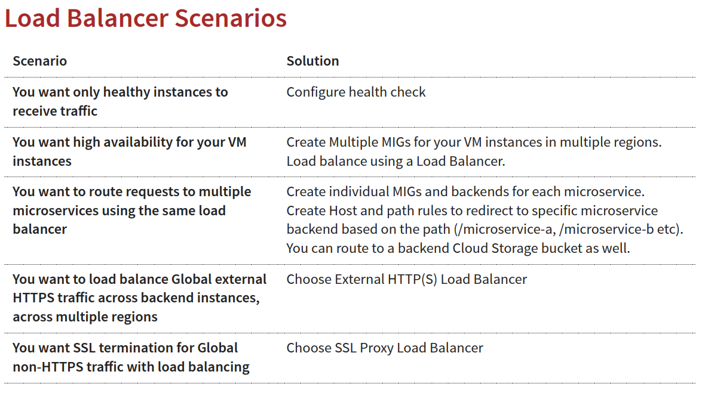

# Cloud Load Balancing
## 將單一region或多個region中，vm instance的使用者流量平衡分散(Fully distributed, soware defined managed service)
* 主要常見功能:
    1. Health check - Route to healthy instances(Recover from failure)
    2. Auto Scaling
    3. Global load balancing with single anycast IP(Also supports internal load balancing)
透過load balancing保有High Availability/Auto Scaling/Resiliency

### HTTP vs HTTPS vs TCP vs TLS vs UDP
|| **network layer** | **transport layer** | **application layer** |
| :--: | :--: | :--: | :--: |
|**定義**| 負責將數據包 (packets) 從源端路由到目的端 | 提供端到端 (end-to-end) 的可靠數據傳輸 |應用程式提供網路服務 |
|**功能**| 處理邏輯地址 (例如 IP 地址) 和路由選擇 | 負責流量控制、錯誤校正和分割/重組數據 | 直接與用戶互動( REST API calls and Send Emails) |
|**場景**| 路由器 | TCP、UDP、TLS | HTTP、FTP、SMTP、DNS |

> TCP (Transmission Control): Reliability > Performance
> TLS (Transport Layer Security): Secure TCP
> UDP (User Datagram Protocol): Performance > Reliability

* 絕大部分的應用都在應用層溝通，例如:Web apps/REST API(HTTP/HTTPS)、Email Servers(SMTP)、File Transfers(FTP)，
這些應用透過 TCP/TLS at network layer(forreliability)溝通
* 有些應用為了高效能(傳輸速度)會捨棄可靠性(EX.能不能丟包)，會直接在transport layer溝通，例如:遊戲、影音串流

### 常見專有名稱
* Backend: 可以是執行個體群組 (由多個 VM 執行個體組成)、區域網路端點群組 (包含 IP 位址和連接埠) 或無伺服器網路端點群組 (例如 Cloud Run、App Engine)，
接收來自於 Google Cloud load balancer分配的流量 
* Frontend: 前端需要一個或多個 IP 位址，使用者透過這些 IP 位址來存取應用程式
Specify an IP address, port and protocol. This IP address is the frontend IP for your clients requests
* Host and path rules (主機和路徑規則): 定義分配流量的規則
    當使用者向你的應用程式發送請求時，請求的 URL 包含兩個主要部分:
    1. 主機 (Host)： 網域名稱或 IP 位址，例如 www.example.com 或 192.0.2.1。
    主機比對可以使用以下方式：
    完全匹配： 例如 www.example.com 只會匹配 www.example.com。
    萬用字元： 使用 * 代表任意字元，例如 *.example.com 會匹配 blog.example.com、shop.example.com 等。

    2. 路徑 (Path)： URL 中主機後面的部分，例如 /images、/api/v1 或 /products/shoes。
    路徑比對可以使用以下方式：
    前綴匹配： 例如 /images 會匹配 /images、/images/products、/images/users/avatars 等。
    完全匹配： 例如 /exact/path 只會匹配 /exact/path。

    3. header: Authorization header and methods (POST, GET, etc)，可以透過 URL 設計、Cloud CDN 的自訂要求標頭、進階流量管理或在後端服務中處理等替代方案來實現類似的功能，後端服務負責驗證 Authorization header 並根據 HTTP method 執行相應的邏輯(==待確認==)

### SSL/TLS Termination/Offloading
> SSL (Secure Sockets Layer) 和 TLS (Transport Layer Security) 是用於在網路通訊中提供安全性的加密協定。
> 它們確保在用戶端（例如瀏覽器）和伺服器之間傳輸的資料是加密的，防止被竊聽或篡改。當你在瀏覽器網址列看到 https:// 時，就表示使用了 SSL/TLS 加密。
* SSL/TLS Termination/Offloading: 就是由負載平衡器負責處理加密和解密的工作，而不是由後端的伺服器直接處理
 
#### 運作流程圖
1. 用戶端發送請求： 用戶端（例如瀏覽器）向負載平衡器發送一個加密的 HTTPS 請求。
2. 負載平衡器終止 SSL/TLS： 負載平衡器接收到請求後，使用其配置的 SSL 憑證來解密流量。
3. 負載平衡器轉發請求： 解密後的請求（通常是 HTTP）會被轉發到後端的伺服器。
4. 後端伺服器處理請求： 後端伺服器接收到未加密的請求並進行處理。
5. 後端伺服器回覆： 後端伺服器將回應傳回給負載平衡器。
6. 負載平衡器加密回應： 負載平衡器使用相同的 SSL 憑證再次加密回應。
7. 負載平衡器傳送回應： 加密後的回應會被傳回給用戶端。

#### 優點
1. 降低後端伺服器的負載： SSL/TLS 加密和解密需要大量的 CPU 資源。將這些工作卸載到負載平衡器可以釋放後端伺服器的資源，讓它們更專注於處理應用程式邏輯。
2. 簡化憑證管理： 你只需要在負載平衡器上管理 SSL 憑證，而不需要在每個後端伺服器上都安裝和更新憑證，簡化了管理流程。
3. 提高安全性： 集中管理憑證可以更容易地實施安全策略，例如使用最新的 TLS 版本和加密套件。
4. 提高效能： 負載平衡器通常具有專門的硬體或軟體來處理 SSL/TLS 加密和解密，效率比一般的伺服器更高。

#### 名詞補充
* PROXY (代理)
當使用代理模式時，中間設備會充當用戶端和伺服器之間的「中間人」。
1. 接收請求： 用戶端將請求發送到代理伺服器。
2. 建立新的連線： 代理伺服器會建立一個 新的 連線到後端伺服器。
3. 轉發請求： 代理伺服器將用戶端的請求轉發到後端伺服器。
4. 接收回應： 後端伺服器將回應發送回代理伺服器。
5. 轉發回應： 代理伺服器將回應轉發回用戶端。

* **優點**
1. 中斷連線： 代理伺服器會完全中斷用戶端和伺服器之間的連線。用戶端和伺服器彼此 不知道 對方的存在。它們只與代理伺服器通訊。
2. 檢查和修改流量： 由於代理伺服器會處理所有流量，因此它可以檢查、修改或記錄流量。這可以用於許多目的，例如：
3. 安全性： 過濾惡意流量、執行入侵偵測/防禦。
4. 快取： 快取常用的內容以提高效能。
5. 負載平衡： 將流量分配到多個後端伺服器。
6. 協定轉換： 在不同的協定之間轉換流量（例如 HTTP 到 HTTPS）。
7. 隱藏內部網路結構： 對外部隱藏內部伺服器的 IP 位址和結構。

* PASS THROUGH (直通)
當使用直通模式時，中間設備只會簡單地將流量從用戶端轉發到伺服器，而 不會 中斷連線或檢查流量內容。它就像一條「管道」。
1. 接收請求： 用戶端將請求發送到中間設備。
2. 轉發請求： 中間設備將請求 直接 轉發到後端伺服器，而 不建立新的連線。
3. 接收回應： 後端伺服器將回應發送回中間設備。
4. 轉發回應： 中間設備將回應 直接 轉發回用戶端。

* **優點**
1. 不中斷連線： 中間設備不會中斷用戶端和伺服器之間的連線。它們之間是直接連線的，只是流量會經過中間設備。
2. 不檢查或修改流量： 中間設備通常不會檢查或修改流量的內容。它的主要功能是轉發流量。
3. 效能較高： 由於不需要處理流量內容，因此直通模式的效能通常比代理模式高。

#### 特色比較

#### 常見場景
