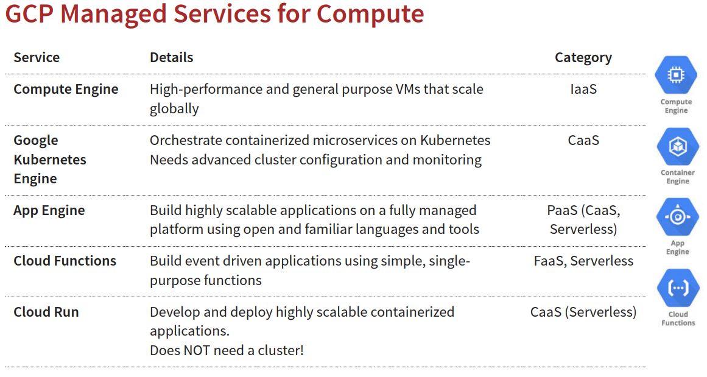

# Managed Services
## 常見服務介紹
1. IaaS (Infrastructure as a Service)
2. PaaS (Platform as a Service)
3. FaaS (Function as a Service)
4. CaaS (Container as a Service)
5. Serverless

### IaaS (Infrastructure as a Service)
>  IaaS 提供最底層的運算資源，例如虛擬機器 (VM)、儲存空間、網路和作業系統。你完全掌控這些資源，可以自行安裝和管理軟體、作業系統和應用程式。
* 常見服務
    1. Compute Engine： 提供虛擬機器 (VM)。
    2. Virtual Private Cloud (VPC)： 提供虛擬網路。
    3. Cloud Storage： 提供物件儲存、區塊儲存和檔案儲存。
    4. Persistent Disk： 提供 VM 的區塊儲存。
    5. Load Balancing： 提供負載平衡服務。
* 使用者責任： 管理作業系統、安裝軟體、修補程式、維護伺服器、擴展和縮減資源。
* 優點： 最大程度的控制和彈性，可自定義硬體和軟體環境。
* 缺點： 需要較多的管理工作，例如作業系統維護、安全性更新等。
* 比喻： 就像租用辦公室空間，你可以自行裝潢、配置設備和決定如何使用空間。

### PAAS (Platform as a Service)
> PaaS 提供一個完整的開發和部署環境，包括作業系統、程式語言執行環境、資料庫和中介軟體。你只需專注於開發應用程式，而無需管理底層的基礎設施。
* 常見服務
    1. App Engine： 提供應用程式的部署和擴展平台，支援多種程式語言。
    2. Cloud Run： 提供容器化的應用程式部署和擴展平台。
    3. Cloud SQL： 提供受管理的關聯式資料庫服務 (MySQL、PostgreSQL、SQL Server)。
    4. Cloud Spanner： 提供全球分散式、可擴展的關聯式資料庫服務。
* 使用者責任： 開發和部署應用程式。
* 優點： 簡化開發和部署流程，減少管理工作，提高開發效率。
* 缺點： 相對 IaaS 而言，彈性和控制較少，可能受限於平台提供的功能和工具。
* 比喻： 就像租用附有基本裝潢和設備的辦公室，你可以直接進駐並開始工作。

### FaaS (Function as a Service)
>  FaaS 是一種事件驅動的運算服務，允許你執行單個的「函式」或程式碼片段，而無需管理伺服器或容器。函式會在特定事件觸發時執行，例如 HTTP 請求、資料庫變更或訊息佇列事件。
* 常見服務
    1. Cloud Functions： 提供無伺服器的函式執行環境。
* 使用者責任： 開發和部署函式程式碼。
* 優點： 極高的擴展性，只需為實際使用的運算資源付費，無需管理伺服器。
* 缺點： 開發模式與傳統應用程式不同，可能受限於函式執行的時間和資源限制。
* 比喻： 就像使用共享辦公室的會議室，你只需在使用時預訂，用完即離開。

### CaaS (Container as a Service)
> CaaS 提供容器化的應用程式部署和管理平台。你可以使用 Docker 等容器技術來打包應用程式及其相依性，然後在 CaaS 平台上部署和執行這些容器。
* 常見服務
    1. Google Kubernetes Engine (GKE)： 提供 Kubernetes 叢集管理服務。
    2. Cloud Run： 雖然 Cloud Run 也被歸類為 Serverless，但它底層是基於 Knative 建構的，Knative 是一個基於 Kubernetes 的平台，因此 Cloud Run 也具有 CaaS 的特性。
* 使用者責任： 管理容器映像、定義部署配置、監控容器狀態。
* 優點： 提高應用程式的可攜性和一致性，簡化部署和擴展。
* 缺點： 需要一定的容器技術知識。
* 比喻： 就像租用辦公大樓中的獨立辦公室，你可以自行規劃辦公室的內部配置。

#### Microservices
> 將一個大型應用程式分解成一系列小型、獨立的服務。這些服務彼此獨立運作，並透過輕量的通訊協定（通常是 HTTP/RESTful API）進行溝通
1. 小型且獨立： 每個微服務都專注於一個特定的業務功能，例如使用者驗證、產品目錄或購物車。它們可以獨立開發、部署、擴展和維護，而不會影響其他服務。
2. 鬆散耦合： 微服務之間透過 API 進行溝通，彼此之間的依賴性很低。這使得開發團隊可以更靈活地使用不同的程式語言、框架和技術來開發不同的服務。
3. 分散式管理： 每個微服務都可以由一個小型團隊獨立管理，這有助於提高開發效率和速度。
4. 自動化部署： 微服務架構通常與自動化部署工具和流程結合使用，以實現快速和頻繁的部署。
5. 每一個Microservices建置一個container，彼此獨立管理

### Serverless (無伺服器)
> Serverless 是一種廣泛的概念，涵蓋了 FaaS 和某些 PaaS 服務。它的核心思想是讓開發者無需管理底層的伺服器基礎設施，只需專注於撰寫程式碼。雲端供應商會自動處理伺服器的配置、擴展和維護。
* 常見服務
    1. Cloud Functions： FaaS 服務。
    2. Cloud Run： 容器化的無伺服器平台。
    3. App Engine (部分環境)： 某些 App Engine 環境也提供無伺服器體驗。
    4. Cloud Storage： 物件儲存服務，通常被視為無伺服器服務的一部分。
    5. BigQuery： 無伺服器資料倉儲服務。
* 使用者責任： 開發應用程式或函式程式碼。
* 優點： 極高的擴展性、自動化管理、只需為實際使用的資源付費。(pay for request, not server)
* 缺點： 可能受限於平台提供的功能和工具，除錯和監控可能較為複雜。
* 比喻： 就像使用公共運輸系統，你只需到達目的地，無需關心車輛的維護和路線規劃。

#### Serverless場景
> Scale down to ZERO instances when there is no load, BUT you pay for number (and type) of instances running!
1. Google App Engine (Google Calls it "App Engine is a fully managed, serverlessplatform"), AWS Fargate (AWS calls it "serverless compute engine for containers")

> You pay for invocations
2. Google Functions, AWS Lambda, Azure Functions etc

### 常見服務表
