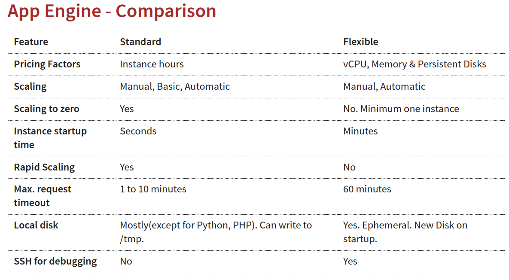
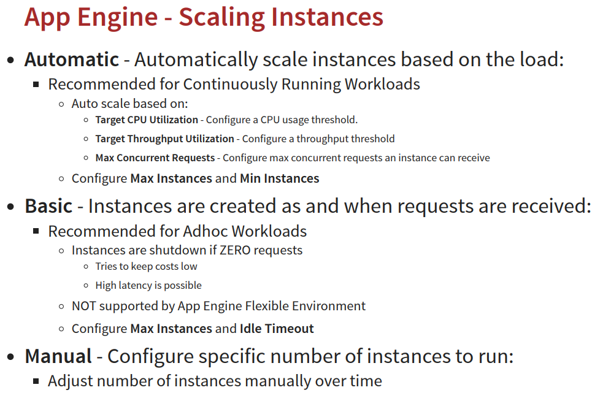
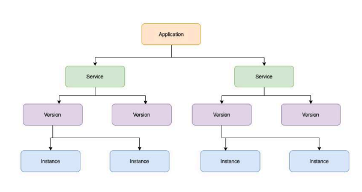
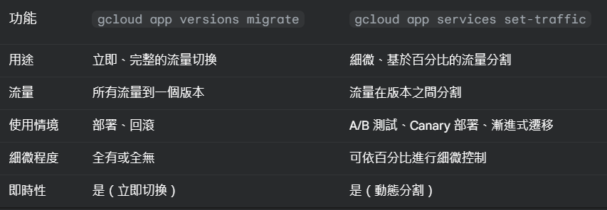
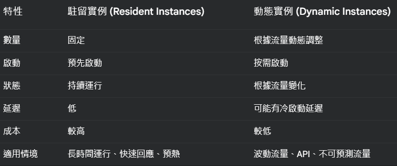
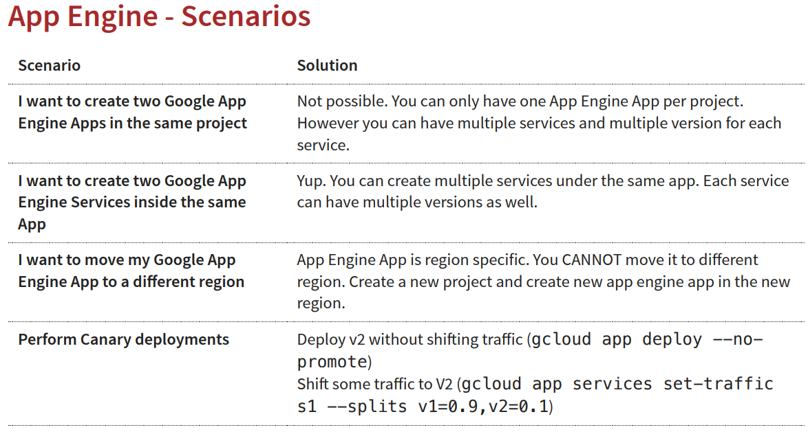

# App Engine
## 專注於撰寫程式碼，而無需管理底層的基礎架構

### app engine
* PaaS
* Serverless
* 資源調度責任低，交由系統自動擴展
* 相對設定上的彈性較低
* 計價:為已佈建的資源付費，意味著你會根據你實際佈建或配置的資源量付費，無論你是否完全使用了這些資源

### App Engine environments
1. Standard: 
    * Applications run in language specific sandboxes(Complete isolation from OS/Disk/Other App)
    * v1: Java, Python, PHP, Go (OLD Versions)，針對python和php有網路限制，白名單內的套件才能安裝
    * v2:  Java, Python, PHP, Node.js, Ruby, Go (NEWER Versions)，基本上無限制

2. Flexible: 
    * Application instances run within Docker containers
    * Support ANY runtime (with built-in support for Python, Java, Node.js, Go, Ruby, PHP, or .NET)
    * Provides access to background processes and local disks


#### 針對Scaling Instances補充


### Application Component Hierarchy
1. 一個專案裡只有一個application
2. application裡面可以有多個Microservices or App components(可以在一個application中含有多個服務)，服務中可以有不同的設定


### Version
1. 版本和code及configuration相關
2. 每一個版本可以在一個或多個instance裡面運行(version有點像是git的概念?)
3. 多個版本可以共存
4. 支援rollback和分流

### Request Routing(參考文件: https://cloud.google.com/appengine/docs/standard/how-requests-are-routed?hl=zh-cn&tab=python)
1. Routing with URLs
    * https://project_id.region_id.r.appspot.com/ => 預設呼叫方式
    * https://service-dot-project_id.region_id.r.appspot.com/ => 呼叫特定服務 
    * https://version-dot-service-dot-project_id.region_id.r.appspot.com/ => 呼叫指定版本的服務

2. Routing with a dispatch file
```{.line-numbers}
# 範例: 範例: 將https://simple-sample.uc.r.appspot.com/mobile/的移動請求路由到移動前端，並將https://simple-sample.uc.r.appspot.com/work/的工作器請求路由到靜態後端
dispatch:
  # Send all mobile traffic to the mobile frontend.
  - url: "*/mobile/*"
    service: mobile-frontend

  # Send all work to the one static backend.
  - url: "*/work/*"
    service: static-backend
```

部署dispatch file 
```{.line-numbers}
gcloud app deploy dispatch.yaml
```

3. Routing with Cloud Load Balancing

### 應用案例: Deploying new versions without downtime, from v1 to v2
#### 參考文件: https://cloud.google.com/appengine/docs/standard/migrating-traffic?hl=zh-cn#gcloud
1. 一次性把所有v1的流量轉移到v2
```{.line-numbers}
gcloud app deploy
```
2. 自訂義流量搬移指令:
```{.line-numbers}
# STEP 1: Deploy v2 without shiing traic (--no-promote)
gcloud app deploy --no-promote
```
```{.line-numbers}
# STEP 2: Shift traffic to V2:
# Option 1 (All at once Migration): Migrate all at once to v2
gcloud app services set-traic s1 --splits V2=1

# Option 2 (Gradual Migration): Gradually shift traffic to v2. Add --migrate option.
# Gradual migration is not supported by App Engine Flexible Environment

# Option 3 (Splitting): Control the pace of migration
# Useful to perform A/B testing
gcloud app services set-traic s1 --splits=v2=.5,v1=.5
```

### 在不同版本的應用程式之中切分流量(根據split-by)
#### https://cloud.google.com/appengine/docs/standard/splitting-traffic?hl=zh-cn
1. ip
    * ip可能會變動，舉例:家中上網和從咖啡廳上網
    * 如果是走公司vpn的single ip話，則所有的route request會被導向同一個版本
2. cookie(GOOGAPPUID)
    * HTTP request header中名為GOOGAPPUID的Cookie，則該Cookie包含一個0-999之間的值，如果存在此Cookie，則使用該值路由請求。如果沒有此Cookie，則會先新增具有0-999之間的隨機值的GOOGAPPUID Cookie，然後再根據該值進行route request

```{.line-numbers}
gcloud app services set-traffic s1 --splits=v2=.5,v1=.5 --splitby=cookie, ip, random
```
3. random(教材有但官方文件沒有)

### 常見指令
* gcloud app browse/create/deploy/describe/open-console
```{.line-numbers}
# 建置應用
gcloud app create --region=us-central

# 部屬yaml設定檔
gcloud app deploy app.yaml

@補充
--image-url: Only for flexible environments. Deploy docker image.
gcloud app deploy --image-url gcr.io/PROJECT-ID/hello-world-rest-api:0.0.1.RELEASE

# 部署的版本是否接收流量
--promote --no-promote 

# 部署新版本後，舊版本是否需繼續接收流量
--stop-previous-version --no-stop-previous-version 

# 自訂義部署版本號，若不指定則自動產生
--version 

# 透過瀏覽器中打開服務
gcloud app browse --service="myService" --version="v1"

# 透過瀏覽器啟動Google Cloud Console開啟服務
gcloud app open-console --service="myService" --version="v1"

# 透過瀏覽器啟動Google Cloud Console存取應用程式的日誌
gcloud app open-console --log

# 類似 Linux 系統中的 tail -f 命令，可以讓你持續追蹤日誌檔的最新內容
gcloud app logs tail

# 列出所有可用的 Google App Engine (GAE) 區域 
gcloud app regions list
```

* gcloud app instances delete/describe/list/scp/ssh
```{.line-numbers}
# 刪除 Google App Engine 應用程式的特定執行個體
gcloud app instances delete i1 --service=s1 --version=v1

# 檢視 Google App Engine 應用程式中特定執行個體的詳細資訊
gcloud app instances describe --service=s1 --version=v1 i1

# 列出 Google App Engine 應用程式的所有執行個體
gcloud app instances list

#  Google App Engine 應用程式的特定執行個體和你的本地目錄之間，安全地複製檔案(secure copy file via ssh, Flexible mode only)
gcloud app instances scp --service=s1 --version=v1 --recurse local_dir i1:remote_dir

# 透過 SSH 連線到 Google App Engine 應用程式的特定執行個體
gcloud app instances ssh --service=s1 --version=v1 i1 
```

* gcloud app services browse/delete/describe/list/set-traffic
```{.line-numbers}
# 列出所有 App Engine 服務
gcloud app services list

# 預設網路瀏覽器中開啟指定的 Google App Engine 服務和版本
gcloud app services browse myService --version="v1"

# 刪除一個 App Engine 服務
gcloud app services delete service1 service2

# 顯示特定服務的詳細資訊
gcloud app services describe service1

# 設定服務的流量分配，例如在不同版本之間分配流量
gcloud app services set-traic APP1 --splits v1=0.9,v2=0.1
--split_by (ip, cookie, random)
```

* gcloud app versions browse/delete/describe/list/migrate/start/stop
```{.line-numbers}
# 列出所有 App Engine 應用程式的版本
gcloud app versions list
--hide-no-traic (Only show versions that are receiving traic)

# 透過連覽器進入/刪除/描述
gcloud app versions browse/delete/describe v1 --service="myService"

# 將流量從一個版本遷移到另一個版本
gcloud app versions migrate v2 --service="myService" (migrate all traic to new version)

# 启动或停止 Google App Engine 应用程序的特定版本
gcloud app versions start/stop v1
--service=my-service Only start v1 of service my-service
```
* migrate vs set-traffic


### Cron Job
> 一種在特定時間或間隔重複執行的任務。它們通常用於自動化例行性工作，例如備份、資料清理、發送電子郵件通知等

1. 建立 cron_job.yaml
```{.line-numbers}
cron:
- description: "每天凌晨 2 点执行的任务"
  url: /my_task  # 任务的 URL
  schedule: every day 02:00  # 任务执行的时间
  timezone: Asia/Taipei  # 时区（可选）
```
2. 在GAE上部署flask(或其他接收request框架，route對應cron_job.yaml的url)
```{.line-numbers}
from flask import Flask

app = Flask(__name__)

@app.route('/my_task')
def my_task():
    # 在这里编写任务的具体逻辑
    # 例如，发送邮件、更新数据等
    print("任务执行成功！")
    return 'OK', 200

if __name__ == '__main__':
    app.run(debug=True)
```

3. 部署 cron_job.yaml 
```{.line-numbers}
gcloud app deploy cron_job.yaml
```

### 其他yaml設定
* dispatch.yaml - override routing rules
```{.line-numbers}
dispatch:
- url: "*/mobile/*"
  service: mobile-frontend
- url: "*/work/*"
  service: static-backend
```

* queue.yaml - manage task queues
```{.line-numbers}
queue:
- name: fooqueue
  rate: 1/s
  retry_parameters:
    task_retry_limit: 7
    task_age_limit: 2d
```

### 小結
* GAE 應用程式為 Regional(建立後無法更動region)，服務可以跨多個zone部署
* 適合建立微服務
    1. 如果開發簡單應用時，使用Standard v2模式
    2. 如果要使用container選擇Flexible模式
* 如果使用Flexible模式，至少要有一個container運行，如果想要讓instance沒有使用時可以被在scale down為0的話，擇使用standard
* standard模式下，可以選用2種方式
    1. Resident Instances(駐留實例): 不管流量都會以固定配置的資源運行
    2. Dynamic Instances(動態實例): 根據流量動態調整資源


### 場景整理

    