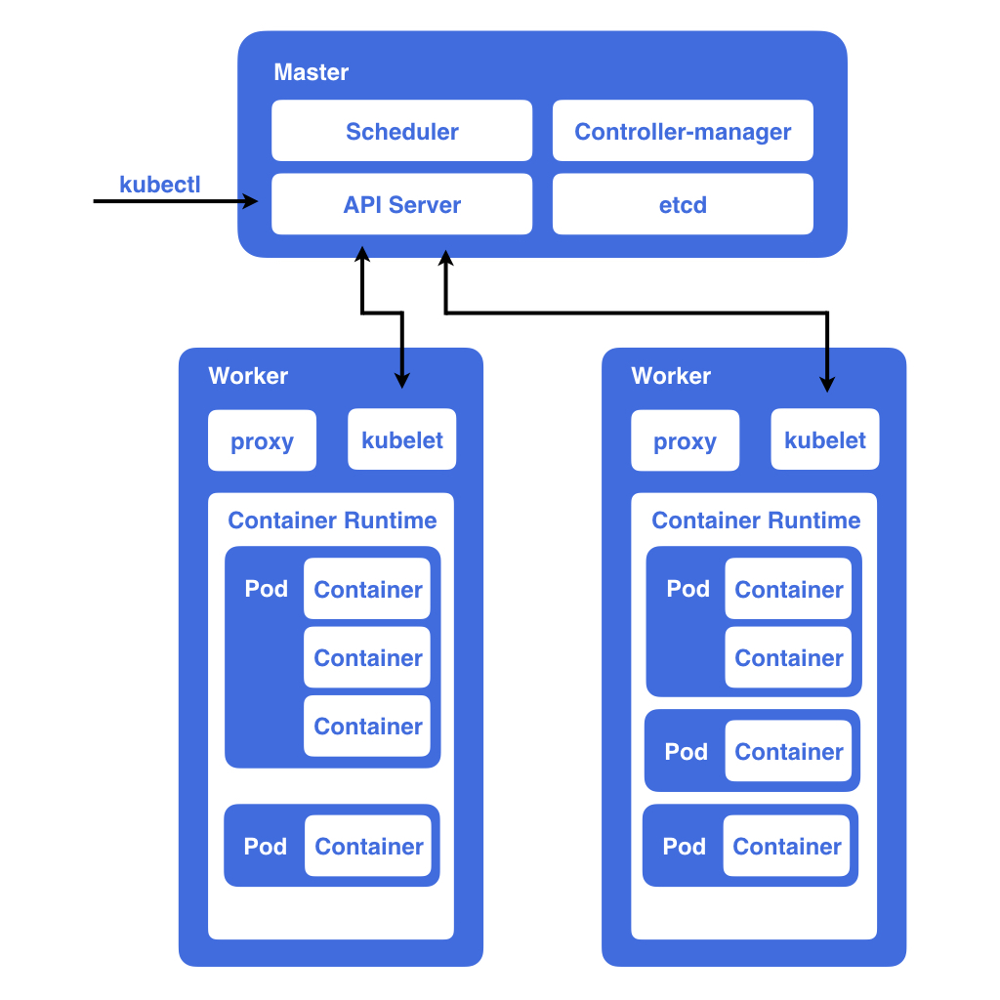
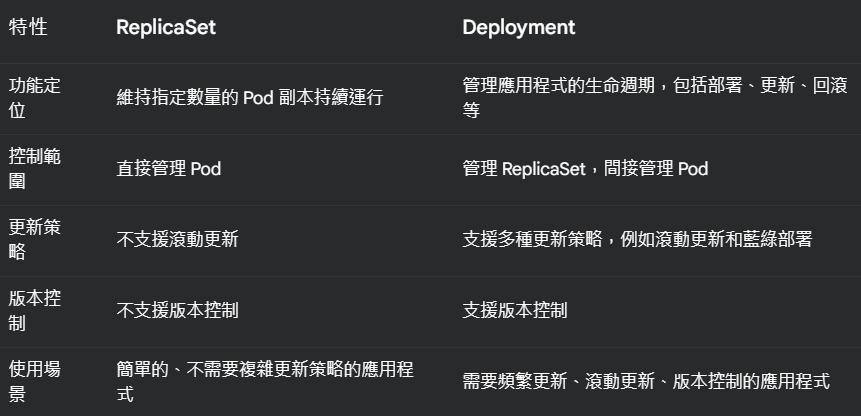
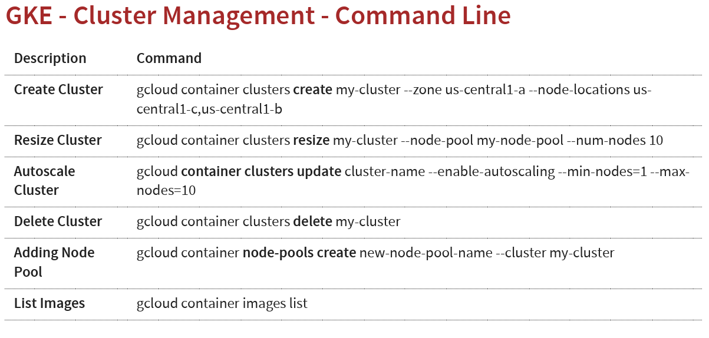
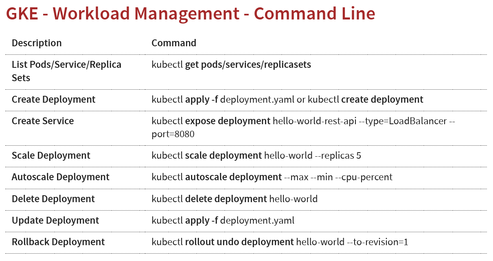
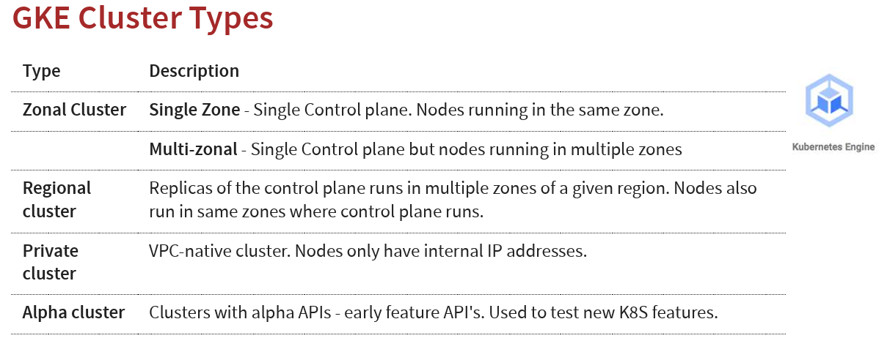
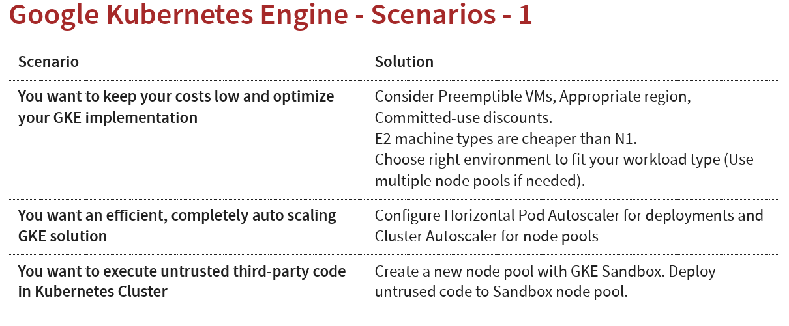
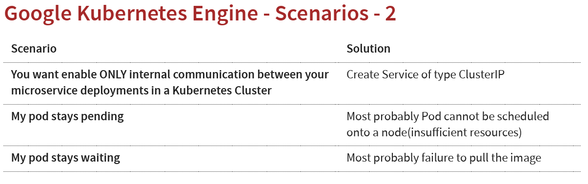

# Google Kubernetes Engine(GKE)
## 再進到GKE前，先簡單看甚麼是K8S
[官方介紹](https://kubernetes.io/zh-cn/docs/concepts/overview/)

### k8s介紹
Kubernetes（K8S）是一個可以幫助我們管理微服務（microservices）的系統，他可以自動化地部署及管理多台機器上的多個容器（Container）。簡單來說，他可以做到：
* 同時部署多個容器到多台機器上
* 管理多個容器的狀態，自動偵測並重啟故障的容器

### Kubernetes 基本的元件
[筆記](https://github.com/HcwXd/kubernetes-tutorial?tab=readme-ov-file)


### Kubernetes Deployment vs ReplicaSet
> ReplicaSet: 確保指定數量的 Pod 副本 (replicas) 持續運行。它專注於維持 Pod 的期望狀態，並在 Pod 故障或節點故障時自動重新創建 Pod。

> Deployment: 提供更高層次的抽象，用於管理應用程式的生命週期，包括部署、更新、滾動更新、回滾等。它使用 ReplicaSet 來實現 Pod 的管理，但本身不直接管理 Pod。

ReplicaSet: 不支援滾動更新。更新 Pod 需要先刪除舊的 ReplicaSet，再創建新的 ReplicaSet。
Deployment: 支援多種更新策略，例如滾動更新 (Rolling Update) 和藍綠部署 (Blue/Green Deployment)。可以平滑地更新應用程式，而不會造成服務中斷。

ReplicaSet: 不支援版本控制。
Deployment: 支援版本控制。每次更新都會創建一個新的 ReplicaSet，並保留舊的 ReplicaSet，方便進行回滾操作。



### Kubernetes Service
> 在 Kubernetes 中，Service 是一種抽象層，用於公開 Pod 的應用程式，讓外部可以透過 Service 存取 Pod。Service 提供了一個穩定的端點，
> 即使 Pod 的 IP 位址或數量發生變化，外部仍然可以透過這個端點存取應用程式。

```{.line-numbers}
# Create Service
kubectl expose deployment name --type=LoadBalancer --port=80

@補充說明
將 Deployment 暴露成一個 LoadBalancer 類型的 Service，讓外部可以透過負載平衡器存取你的應用程式
```

每一個pod都有自己的ip，且當pod fails時，會自動被replica set取代
pod對外網溝通時，使用static IP

* Service 的類型
1. ClusterIP： 預設類型。Service 只在叢集內部可存取，外部無法直接存取。
使用情景: You want your microservice only to be available inside the cluster (Intra cluster communication)
2. NodePort： 在每個節點上開啟一個靜態埠，外部可以透過節點的 IP 位址和該埠存取 Service。
使用情景: You DO not want to create an external Load Balancer for each microservice (You can create one Ingress component to load balance multiple microservices)
3. LoadBalancer： 使用雲端供應商的負載平衡器，將流量分發到後端的 Pod。
使用情景: You want to create individual Load Balancer's for each microservice

### Google Kubernetes Engine
1. GKE主要用來管理K8S
待補

### 常見指令
```{.line-numbers}
# 1.Create a Kubernetes cluster with the default node pool(https://cloud.google.com/sdk/gcloud/reference/container/clusters/create)
gcloud container clusters create xxx

# 2.Login to Cloud Shell 

# 3.Connect to the Kubernetes Cluster 
gcloud container clusters get-credentials my-cluster --zone us-central1-a --project solid-course-258105

# 4.Deploy Microservice to Kubernetes(Create deployment & service using kubectl commands)
kubectl create deployment hello-world-rest-api --image=in28min/hello-world-rest-api:0.0.1.RELEASE 
kubectl expose deployment hello-world-rest-api --type=LoadBalancer --port=8080

# 5.Increase number of instances of your microservice
kubectl scale deployment hello-world-rest-api --replicas=2

# 6. Increase number of nodes in your Kubernetes cluster
gcloud container clusters resize my-cluster --node-pool my-node-pool --num-nodes 5

# 7. Setup auto scaling for your microservice
kubectl autoscale deployment hello-world-rest-api --max=10 --cpu-percent=70
(Also called horizontal pod autoscaling - HPA - kubectl get hpa)

# 8. Setup auto scaling for your Kubernetes Cluster(第六點相反)
gcloud container clusters update cluster-name --enable-autoscaling --min-nodes=1 --max-nodes=10

# 9.Add some application configuration for your microservice
kubectl create configmap todo-web-application-config --fromliteral=RDS_DB_NAME=todos

# 10. Add password configuration for your microservice
kubectl create secret generic todo-web-application-secrets-1 -- from-literal=RDS_PASSWORD=dummytodos

# 11. Deploy a new microservice which needs nodes with a **GPU** attached
gcloud container node-pools create gpu-pool \
    --cluster my-cluster \
    --machine-type n1-standard-4 \
    --accelerator type=nvidia-tesla-t4,count=1 \
    --num-nodes 3 \
    --zone us-central1-a

成功建立節點池後，您可以使用以下指令來驗證
gcloud container node-pools list --cluster my-cluster

# 12. Delete the Microservices
kubectl delete service: 想要暫時或永久停止公開應用程式(刪除的是 Service 物件本身，以及與該 Service 相關的 Endpoints)
kubectl delete deployment: 想要停止應用程式的運行，或者需要更新應用程式的部署方式(刪除的是 Deployment 物件本身，以及由該 Deployment 管理的所有 ReplicaSet 和 Pod)

# 13. Delete the Cluster
gcloud container clusters delete
整個 GKE 叢集，包括控制平面 (Control Plane) 和所有節點 (Nodes)，所有資料都將被永久刪除
```



### GKE Cluster種類


### GKE Container Registry
> Container Registry 是一個由 Google Cloud Platform (GCP) 提供的全託管服務，用於儲存、管理和保護 Docker 容器映像。它允許開發人員安全地儲存和取用容器映像，並與其他 GCP 服務（如 Google Kubernetes Engine (GKE) 和 Cloud Run）無縫整合，方便部署容器化應用程式。

### 其他細節補充
* 高可用性 (High Availability)
1. 為了確保叢集的高可用性，務必將 Master 節點 (Control Plane) 跨多個可用區 (zones) 部署。這樣即使某個可用區發生故障，叢集仍然可以正常運作

* GKE 為了確保 Control Plane(master node) 的各個組件有足夠的資源可用，GKE 會在每個節點上預留一部分 CPU 資源供 Control Plane 使用，以避免應用程式佔用過多資源，影響 Control Plane 的正常運作

假設一個節點有 4 個核心，Control Plane 預留的 CPU 資源如下：
第 1 個核心： 4 核 * 6% = 0.24 核
第 2 個核心： 4 核 * 1% = 0.04 核
第 3 和第 4 個核心： 4 核 * 0.5% * 2 = 0.04 核
總共預留： 0.24 + 0.04 + 0.04 = 0.32 核
這表示在這個 4 核心的節點上，有 0.32 個核心的 CPU 資源會被 Control Plane 預留，剩餘的 3.68 個核心才能供應用程式使用

* 建立image供為服務使用
```{.line-numbers}
# Build Image
docker build -t in28min/hello-world-rest-api:0.0.1.RELEASE . 

# Test it Locally: 
docker run -d -p 8080:8080 in28min/hello-world-rest-api:0.0.1.RELEASE Push it 

# Push it to Container Repository 
docker push in28min/hello-world-rest-api:0.0.1.RELEASE
```

* Kubernetes 監控與日誌
1. 整合 Cloud Monitoring 和 Cloud Logging: GKE 與 Cloud Monitoring 和 Cloud Logging 整合，提供全面的監控和日誌記錄功能。
2. Cloud Logging: 系統和應用程式日誌可以匯出到 BigQuery 或 Pub/Sub

* Kubernetes 部署類型
1. StatefulSet (適用於狀態型應用): StatefulSet 適用於需要持久化儲存和穩定網路識別的應用程式，例如 Kafka、Redis 和 ZooKeeper。每個 Pod 都有唯一的、持久的身份和穩定的主機名稱。
2. DaemonSet (守護進程): DaemonSet 確保每個節點上都運行一個 Pod。適用於日誌收集、監控等後台服務。 Kubernetes 預設會啟用 DaemonSet 來收集節點的系統日誌。

* Docker 容器映像建構
Dockerfile: 使用 Dockerfile 定義容器映像的內容和建構步驟。
1. 建構映像: 使用 docker build -t in28min/hello-world-rest-api:0.0.1.RELEASE . 指令建構映像。 -t 參數指定映像的名稱和標籤，. 表示 Dockerfile 所在的目錄。
2. 本地測試: 使用 docker run -d -p 8080:8080 in28min/hello-world-rest-api:0.0.1.RELEASE 指令在本地運行映像。 -d 參數表示在後台運行，-p 參數將容器的 8080 埠映射到主機的 8080 埠。
3. 推送映像到容器倉庫: 使用 docker push in28min/hello-world-rest-api:0.0.1.RELEASE 指令將映像推送到容器倉庫，例如 Google Container Registry (GCR)。 推送前需要先登錄到容器倉庫 (docker login gcr.io)

### 其他場景整理


