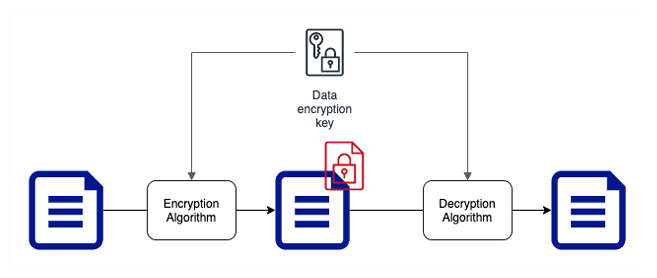
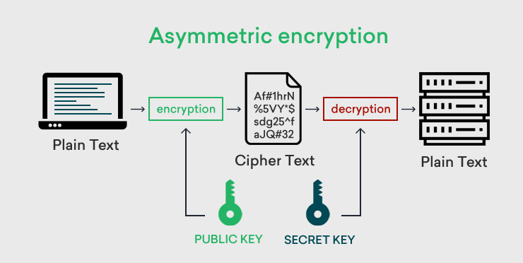

# Encryption
## 介紹
### Data States
* Data at rest: 資料儲存在裝置或備援中(data on a hard disk, in a database, backups and archives)
* Data in motion(Data in transit): 資料透過網路傳遞中(Data copied from on-premise to cloud storage, An application talking to a database)，可以分為在雲端外或內
* Data in use: 資料處於非穩定的狀態(Data in your RAM)

### 加密核心概念
1. 靜態加密 (Encryption at Rest): 指資料儲存在儲存裝置上時的加密狀態。這包括硬碟、固態硬碟、資料庫、物件儲存等。目的是防止未經授權的使用者存取儲存的資料
2. 傳輸中加密 (Encryption in Transit): 指資料在網路傳輸過程中，例如在您的應用程式和 GCP 服務之間、或在不同的 GCP 服務之間傳輸時的加密狀態。目的是防止資料在傳輸過程中被攔截或竊聽
3. 金鑰管理 (Key Management): 加密的強度很大程度取決於金鑰的安全管理

#### Symmetric Key Encryption(對稱金鑰加密)

> 對稱金鑰加密，也稱為私密金鑰加密，是一種最古老且廣泛使用的加密形式。它的核心概念非常簡單：在加密和解密資料時，使用相同的金鑰

##### 運作方式
對稱金鑰加密的運作流程大致如下：

1. 金鑰生成 (Key Generation): 首先，需要產生一個金鑰。這個金鑰必須是保密的，只有通訊的雙方才能知道。金鑰的強度通常取決於其長度，更長的金鑰通常更難被破解。
2. 加密 (Encryption): 當發送者想要傳輸資料時，他們會使用金鑰和一種稱為加密演算法的數學公式，將原始資料（稱為明文，Plaintext）轉換成無法理解的亂碼（稱為密文，Ciphertext）。 這個過程就像使用秘密鑰匙鎖上寶箱一樣。
3. 傳輸 (Transmission): 加密後的密文會透過網路或其他通訊管道傳送給接收者。
4. 解密 (Decryption): 接收者收到密文後，由於他們也擁有相同的金鑰，他們可以使用這個金鑰以及解密演算法（通常是加密演算法的反向運算），將密文還原成原始的明文。 這就像使用相同的秘密鑰匙打開寶箱，取出裡面的資料。

#### Asymmetric Key Encryption(非對稱金鑰加密)

> 非對稱金鑰加密與對稱金鑰加密最大的不同之處在於：它使用一對金鑰，而非單一金鑰。這一對金鑰包含：
> * 公鑰 (Public Key): 公鑰可以公開給任何人。就像您的公開郵箱地址一樣，任何人都可以用公鑰來加密訊息，準備寄給您。
> * 私鑰 (Private Key): 私鑰必須嚴格保密，只有金鑰的擁有者才能知道。就像您郵箱的鑰匙，只有您才能用私鑰解密那些使用您的公鑰加密的訊息。

##### 運作方式
非對稱金鑰加密的運作流程主要包含以下幾個步驟：

1. 金鑰對生成 (Key Pair Generation): 首先，金鑰擁有者需要生成一對金鑰，包含公鑰和私鑰。這兩個金鑰在數學上是相關聯的，但從公鑰推算出私鑰在計算上是極其困難的。金鑰對的生成通常依賴於複雜的數學演算法，例如RSA、橢圓曲線密碼學 (ECC) 等。
2. 公鑰發布 (Public Key Distribution): 金鑰擁有者需要安全地將公鑰公開給需要與其通訊的人。公鑰可以透過多種方式發布，例如透過網站、公開金鑰基礎設施 (PKI)、金鑰伺服器等。 公鑰的公開不會影響安全性，因為沒有私鑰就無法解密使用公鑰加密的訊息。
3. 加密 (Encryption): 當發送者想要傳輸資料給接收者時，他們會使用接收者的公鑰和一種加密演算法，將原始資料（明文）轉換成密文。 重要的是，只有接收者的公鑰才能用於加密，而且使用公鑰加密的訊息，只能使用對應的私鑰才能解密。
4. 傳輸 (Transmission): 加密後的密文會透過網路或其他通訊管道傳送給接收者。
5. 解密 (Decryption): 接收者收到密文後，由於他們是唯一擁有與公鑰配對的私鑰的人，他們可以使用自己的私鑰以及解密演算法（通常與加密演算法相關），將密文還原成原始的明文。

### Google Cloud KMS
> Google Cloud KMS 是一個託管式的金鑰管理服務，讓您可以在雲端輕鬆安全地管理加密金鑰。它讓您能夠控制用於保護雲端資料的金鑰，包括產生、使用、輪換和銷毀金鑰

除了上述的公鑰及私鑰外，KMS還有以下功能:
* 客戶管理的金鑰 (Customer-managed keys, CMK): 您可以自行產生金鑰，並將其匯入 Cloud KMS，或在 Cloud KMS 中產生金鑰，並擁有金鑰的完整控制權，包括金鑰的生命週期管理和權限控制。CMK 又可以細分為：
    1. Cloud KMS 金鑰 (Cloud KMS keys): 金鑰材料儲存在 Cloud KMS 的 HSM (硬體安全模組) 中，由 Google 管理硬體安全，但您擁有金鑰的邏輯控制權。
    2. Cloud HSM 金鑰 (Cloud HSM keys): 金鑰材料完全儲存在您專屬的 Cloud HSM 叢集中，您可以完全控制金鑰的硬體安全。
    3. 外部金鑰 (External keys, EKMs): 金鑰材料儲存在您自己的外部金鑰管理系統中，Cloud KMS 只會持有金鑰的參考，當需要使用金鑰時，Cloud KMS 會呼叫您的外部系統

* 金鑰環(Key Ring):金鑰環是用於組織和管理金鑰的邏輯容器。您可以將相關的金鑰放在同一個金鑰環中，方便管理權限和位置。金鑰環是區域性的資源，建立金鑰環時需要指定區域
* 金鑰版本 (Key Version):
當您輪換金鑰時，Cloud KMS 會建立新的金鑰版本。每個金鑰可以有多個版本，但只有一個版本是主要版本 (Primary version)，用於新的加密操作。舊的金鑰版本仍然可以保留，用於解密之前使用該版本加密的資料。金鑰版本有不同的狀態，例如：
    1. ENABLED (已啟用): 金鑰版本可以正常使用於加密和解密。
    2. DISABLED (已停用): 金鑰版本無法用於新的加密操作，但仍然可以解密之前使用該版本加密的資料。
    3. DESTROYED (已銷毀): 金鑰版本被永久銷毀，無法再使用。

* 位置(Location): Cloud KMS 的資源 (例如金鑰環和金鑰) 是區域性的或全球性的。區域性資源會儲存在特定地理區域內，而全球性資源則會跨多個區域分散儲存，以提高可用性。選擇位置時需要考慮法規遵循要求和效能需求。

* 數位簽章 (Digital Signatures): 您可以使用非對稱金鑰在 Cloud KMS 中產生數位簽章，用於驗證資料的完整性和來源。例如，您可以使用私鑰簽署程式碼或文件，然後使用公鑰驗證簽章，確保程式碼或文件未被篡改且來自可信任的來源

